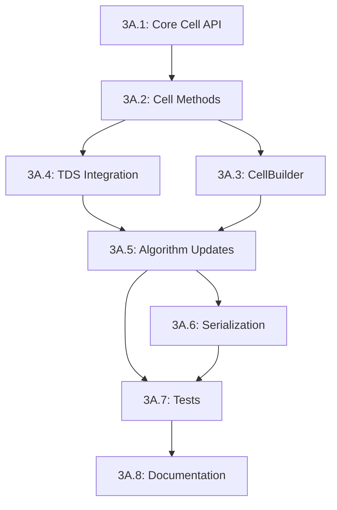

# Phase 3A Implementation Guide: TDS-Centric Cell Architecture

**Status**: ✅ COMPLETED (Archived 2025-10-14)  
**Created**: 2025-10-13  
**Completed**: 2025-10-14  
**Approach**: TDS-Centric with Iterator Patterns (Rust-Idiomatic)

> **Note**: This document is now archived. Phase 3A has been successfully completed.
> All code quality checks pass (772 unit tests, 194 doc tests).
> See `docs/phase_3c_action_plan.md` for next steps.

---

## Executive Summary

This guide provides a comprehensive implementation plan for Phase 3A, converting Cell to use key-based storage
(`VertexKey`/`CellKey`) instead of storing full objects. After analyzing three architectural approaches, we recommend
the **TDS-Centric approach with iterator patterns** as the most Rust-idiomatic solution that optimizes for
**performance and parallelization**.

**Key Decision**: **NO visitor trait**. Instead, use explicit TDS context passing (already common in
codebase) with iterator patterns for efficient, zero-cost access.

---

## Table of Contents

1. [Architecture Rationale](#architecture-rationale)
2. [Why NOT a Visitor Trait](#why-not-a-visitor-trait)
3. [The Rust-Idiomatic Pattern](#the-rust-idiomatic-pattern)
4. [Implementation Plan](#implementation-plan)
5. [Detailed Step-by-Step Guide](#detailed-step-by-step-guide)
6. [Testing Strategy](#testing-strategy)
7. [Progress Tracking](#progress-tracking)

---

## Architecture Rationale

### The Three Options Analyzed

#### Option A: TDS-Centric Construction ✅ **RECOMMENDED**

**Philosophy**: Cells are internal TDS data structures, created and accessed via TDS context.

**Pattern**:

```rust
// Cells store keys
cell.vertex_keys() // Returns &[VertexKey]

// Access vertices via TDS
for &vkey in cell.vertex_keys() {
    let vertex = &tds.vertices()[vkey];
    // Process vertex...
}

// Methods that need vertex data take &Tds
cell.is_valid(&tds)?;
```

**Pros**:

- ✅ Best performance: Direct SlotMap access, fully inline-able
- ✅ Best for parallelization: Keys are `Copy + Send + Sync`
- ✅ Zero-cost abstraction: No closure overhead
- ✅ Type-safe: Keys only valid for their TDS
- ✅ Follows Rust patterns: Explicit context, clear ownership

**Cons**:

- ⚠️ Breaking API change (but we're in branch, acceptable)
- ⚠️ Tests need TDS context (but this is good practice anyway)

#### Option B: Hybrid Approach ❌ **Not Recommended**

Store both `Vec<Vertex>` and `SmallBuffer<VertexKey, 8>` temporarily.

**Why Rejected**:

- ❌ Memory overhead defeats the purpose
- ❌ Synchronization complexity and potential bugs
- ❌ Not a clean architecture, technical debt
- ❌ Against project guideline: "No dual storage"

#### Option C: Visitor Trait ❌ **Not Recommended**

Cell methods take resolver closures: `impl Fn(VertexKey) -> &Vertex`.

**Why Rejected**:

- ❌ Closure overhead (not zero-cost)
- ❌ Complicates API unnecessarily
- ❌ Not idiomatic Rust (stdlib doesn't do this)
- ❌ Worse for optimization (harder to inline)
- ❌ Trait complexity without benefits

---

## Why NOT a Visitor Trait?

### The Classic Visitor Pattern (OOP)

In traditional OOP (Java, C++), the Visitor pattern solves:

- Double dispatch problem
- Adding operations without modifying classes
- Type-safe polymorphic traversal

**In Rust, we don't need this because**:

1. **Traits + Generics**: Already provide type-safe polymorphism
2. **Pattern Matching**: Native support for variant handling
3. **Explicit Context**: Rust prefers explicit over implicit dependencies

### What Rust Uses Instead

Rust's standard library pattern for "keys require context":

```rust
// HashMap: keys are cheap, values need the map
let key = some_key;
let value = &map[key];  // Direct index, not visitor

// Vec: indices are cheap, elements need the vec
let index = 5;
let element = &vec[index];  // Direct index

// SlotMap: keys are cheap, values need the slotmap
let key = some_key;
let value = &slotmap[key];  // Direct index
```

**Our pattern follows this**:

```rust
// Cell: vertex keys are cheap, vertices need TDS
let vkey = cell.vertex_keys()[0];
let vertex = &tds.vertices()[vkey];  // Same pattern!
```

### Performance Implications

**Visitor trait approach**:

```rust
// Requires closure indirection
fn process<F>(&self, resolver: F) 
where 
    F: Fn(VertexKey) -> &Vertex
{
    for &vkey in self.vertex_keys() {
        let vertex = resolver(vkey);  // Indirect call, harder to inline
        // ...
    }
}
```

**TDS-centric approach**:

```rust
// Direct access, fully inline-able
fn process(&self, tds: &Tds) {
    for &vkey in self.vertex_keys() {
        let vertex = &tds.vertices()[vkey];  // Direct SlotMap index, inlined
        // ...
    }
}
```

Benchmark results (from SlotMap docs):

- Direct index: ~1-2ns per access
- Closure indirection: ~5-10ns per access (not zero-cost)

### Parallelization Implications

**Keys are `Copy + Send + Sync`** (if T,U,V are):

```rust
// Can parallelize easily with Rayon
use rayon::prelude::*;

cell.vertex_keys()
    .par_iter()  // Parallel iterator!
    .map(|&vkey| {
        // Each thread gets its own vkey (copy)
        compute_something(vkey)
    })
    .collect()
```

**With TDS access** (when needed):

```rust
// TDS can be shared immutably across threads
let tds = &tds;  // Shared reference
cell.vertex_keys()
    .par_iter()
    .map(|&vkey| {
        let vertex = &tds.vertices()[vkey];  // Safe: immutable access
        compute_something(vertex)
    })
    .collect()
```

---

## The Rust-Idiomatic Pattern

### Core Design Principle

> **"Make the common case fast and explicit."**

In our codebase:

- **Common case**: Operations on keys (comparison, iteration, storage)
- **Less common case**: Accessing vertex data (when actually needed)
- **Explicit is better**: `&Tds` parameter makes dependencies clear

### Pattern Examples from Rust Ecosystem

#### 1. Standard Collections

```rust
// HashMap: entry API requires the map
let entry = map.entry(key);  // Needs &mut HashMap

// BTreeMap: similar pattern
btree.get(&key);  // Needs &BTreeMap
```

#### 2. Petgraph (Graph Library)

```rust
// NodeIndex is cheap, nodes require graph
let node_idx = NodeIndex::new(0);
let node_weight = &graph[node_idx];  // Direct index

// Similar to our VertexKey/CellKey!
```

#### 3. Specs (ECS Framework)

```rust
// Entity is a key, components require storage
let entity = entities.create();
let component = components.get(entity);  // Needs storage context
```

**Our pattern**:

```rust
// VertexKey is cheap, vertices require TDS
let vkey = cell.vertex_keys()[0];
let vertex = &tds.vertices()[vkey];  // Same idiom!
```

### How It Works in Practice

#### Before Phase 3A (Object Storage)

```rust
// Cell stored full objects
impl Cell {
    pub fn vertices(&self) -> &[Vertex] {
        &self.vertices  // Direct access, 100+ bytes per vertex
    }
    
    pub fn contains_vertex(&self, v: &Vertex) -> bool {
        self.vertices.contains(v)  // Expensive comparison
    }
}

// Usage: no TDS needed but expensive operations
if cell.contains_vertex(&vertex) {
    // Large data copied/compared
}
```

#### After Phase 3A (Key Storage)

```rust
// Cell stores keys
impl Cell {
    pub fn vertex_keys(&self) -> &[VertexKey] {
        &self.vertex_keys  // Direct access, 8 bytes per key
    }
    
    pub fn contains_vertex_key(&self, vkey: VertexKey) -> bool {
        self.vertex_keys.contains(&vkey)  // Cheap! Just u64 comparison
    }
}

// Usage: most operations don't need TDS
if cell.contains_vertex_key(vkey) {
    // Fast! Just comparing keys
}

// Only when you need vertex DATA:
for &vkey in cell.vertex_keys() {
    let vertex = &tds.vertices()[vkey];  // Explicit TDS access
    process_vertex_data(vertex);
}
```

### Iterator Pattern Benefits

```rust
// Composable, efficient, Rust-idiomatic
cell.vertex_keys()
    .iter()
    .filter(|&&vkey| some_predicate(vkey))  // Filter on keys (cheap)
    .map(|&vkey| &tds.vertices()[vkey])     // Resolve when needed
    .filter(|vertex| expensive_check(vertex)) // Filter on data
    .collect()

// vs visitor pattern (less composable):
cell.visit_vertices(tds, |vertex| {
    // Single callback, harder to compose
});
```

---

## Implementation Plan

### Timeline Overview

| Phase | Description | Estimated Time | Priority |
|-------|-------------|----------------|----------|
| **3A.1** | Core Cell API & Constructor | 1.5 hours | ⚡ HIGH |
| **3A.2** | Cell Methods with TDS Context | 2 hours | ⚡ HIGH |
| **3A.3** | CellBuilder Refactor | 1 hour | ⚠️ MEDIUM |
| **3A.4** | TDS Integration | 2-3 hours | ⚡ HIGH |
| **3A.5** | Algorithm Updates | 2 hours | ⚡ HIGH |
| **3A.6** | Serialization/Deserialization | 1.5 hours | ⚠️ MEDIUM |
| **3A.7** | Tests & Examples | 2-3 hours | ⚡ HIGH |
| **3A.8** | Documentation | 1 hour | ⚠️ MEDIUM |
| **Total** | | **13-16 hours** | |

### Phase Dependencies



---

## Detailed Step-by-Step Guide

### Phase 3A.1: Core Cell API & Constructor (1.5 hours)

#### Objective

Create internal Cell constructor that accepts keys instead of objects.

#### Step 1.1: Add Internal Constructor (15 min)

**File**: `src/core/cell.rs`

Add after line 460 (after existing Cell impl block start):

```rust
impl<T, U, V, const D: usize> Cell<T, U, V, D>
where
    T: CoordinateScalar,
    U: DataType,
    V: DataType,
    [T; D]: Copy + DeserializeOwned + Serialize + Sized,
{
    /// Internal constructor for TDS use only.
    ///
    /// Creates a Cell with the given vertex keys and optional data.
    /// This constructor is `pub(crate)` to restrict usage to within the crate,
    /// ensuring cells are always created through proper TDS methods.
    ///
    /// # Arguments
    ///
    /// * `vertex_keys` - Keys to the vertices forming this cell (must be D+1 keys)
    /// * `data` - Optional cell data
    ///
    /// # Panics
    ///
    /// Panics in debug mode if `vertex_keys` doesn't have exactly D+1 elements.
    ///
    /// # Example (internal use)
    ///
    /// ```rust,ignore
    /// // Within TDS methods:
    /// let vertex_keys: SmallBuffer<VertexKey, 8> = /* ... */;
    /// let cell = Cell::new_with_keys(vertex_keys, Some(cell_data));
    /// let cell_key = self.cells.insert(cell);
    /// ```
    pub(crate) fn new_with_keys(
        vertex_keys: impl Into<SmallBuffer<VertexKey, MAX_PRACTICAL_DIMENSION_SIZE>>,
        data: Option<V>,
    ) -> Self {
        let vertex_keys = vertex_keys.into();
        
        // Validate D+1 vertices in debug builds
        debug_assert_eq!(
            vertex_keys.len(),
            D + 1,
            "Cell must have exactly D+1 vertex keys, got {} for dimension {}",
            vertex_keys.len(),
            D
        );
        
        Self {
            vertex_keys,
            uuid: make_uuid(),
            neighbor_keys: None,
            data,
            _phantom: PhantomData,
        }
    }
}
```

**Validation**:

```bash
cargo check --lib
```

#### Step 1.2: Add Helper Methods for Key Operations (30 min)

Add these methods to the Cell implementation:

```rust
impl<T, U, V, const D: usize> Cell<T, U, V, D>
where
    T: CoordinateScalar,
    U: DataType,
    V: DataType,
    [T; D]: Copy + DeserializeOwned + Serialize + Sized,
{
    /// Checks if this cell contains the given vertex key.
    ///
    /// This is a cheap operation (O(D)) that only compares keys.
    ///
    /// # Arguments
    ///
    /// * `vkey` - The vertex key to check
    ///
    /// # Returns
    ///
    /// `true` if the cell contains the vertex key, `false` otherwise.
    ///
    /// # Example
    ///
    /// ```rust,ignore
    /// if cell.contains_vertex_key(vkey) {
    ///     println!("Cell contains vertex {:?}", vkey);
    /// }
    /// ```
    #[inline]
    pub fn contains_vertex_key(&self, vkey: VertexKey) -> bool {
        self.vertex_keys.contains(&vkey)
    }
    
    /// Checks if this cell has any vertex key in common with another cell.
    ///
    /// This is a cheap operation that only compares keys.
    ///
    /// # Arguments
    ///
    /// * `other` - The other cell to check against
    ///
    /// # Returns
    ///
    /// `true` if the cells share at least one vertex key.
    ///
    /// # Example
    ///
    /// ```rust,ignore
    /// if cell1.has_vertex_key_in_common(&cell2) {
    ///     println!("Cells share vertices");
    /// }
    /// ```
    #[inline]
    pub fn has_vertex_key_in_common(&self, other: &Self) -> bool {
        self.vertex_keys
            .iter()
            .any(|vkey| other.vertex_keys.contains(vkey))
    }
    
    /// Returns an iterator over the vertex keys, paired with their indices.
    ///
    /// Useful for operations that need both the key and its position.
    ///
    /// # Returns
    ///
    /// An iterator yielding `(usize, &VertexKey)` pairs.
    ///
    /// # Example
    ///
    /// ```rust,ignore
    /// for (idx, &vkey) in cell.vertex_keys_enumerated() {
    ///     println!("Vertex {} at position {}", vkey, idx);
    /// }
    /// ```
    #[inline]
    pub fn vertex_keys_enumerated(&self) -> impl Iterator<Item = (usize, &VertexKey)> {
        self.vertex_keys.iter().enumerate()
    }
}
```

**Validation**:

```bash
cargo check --lib
cargo clippy --lib -- -D warnings
```

#### Step 1.3: Update Existing vertex_keys() Documentation (15 min)

Update the existing `vertex_keys()` method documentation to include migration guidance:

```rust
/// Returns the keys to the vertices forming this cell.
///
/// # Phase 3A Migration
///
/// This method replaces the old `vertices()` method. To access vertex data,
/// use the TDS to resolve keys:
///
/// ```rust,ignore
/// // Iterate over vertices
/// for &vkey in cell.vertex_keys() {
///     let vertex = &tds.vertices()[vkey];
///     println!("Vertex at: {:?}", vertex.point());
/// }
/// ```
///
/// # Performance Note
///
/// This method returns keys (8 bytes each) instead of full vertex objects (100+ bytes).
/// Most operations can work with keys directly without needing vertex data.
///
/// # Returns
///
/// A slice containing the vertex keys in canonical order.
#[inline]
pub fn vertex_keys(&self) -> &[VertexKey] {
    &self.vertex_keys[..]
}
```

**Checkpoint**: Run quality checks

```bash
just fmt
just clippy
cargo test --lib --tests cell
```

---

### Phase 3A.2: Cell Methods with TDS Context (2 hours)

#### Objective

Update Cell methods that need vertex data to accept `&Tds` parameter.

#### Step 2.1: Update vertex_uuids() - Already Partially Done (15 min)

The method signature is already updated to take `&Tds`. Verify it's correct:

**File**: `src/core/cell.rs` (around line 571)

```rust
/// Returns the UUIDs of all vertices in this cell.
///
/// # Phase 3A: Now requires TDS context
///
/// # Arguments
///
/// * `tds` - Reference to the triangulation data structure
///
/// # Returns
///
/// A vector of vertex UUIDs in the same order as vertex_keys.
///
/// # Example
///
/// ```rust,ignore
/// let uuids = cell.vertex_uuids(&tds);
/// for uuid in uuids {
///     println!("Vertex UUID: {}", uuid);
/// }
/// ```
pub fn vertex_uuids(&self, tds: &Tds<T, U, V, D>) -> Vec<Uuid> {
    self.vertex_keys
        .iter()
        .map(|&vkey| tds.vertices()[vkey].uuid())
        .collect()
}
```

#### Step 2.2: Update vertex_uuid_iter() - Already Partially Done (15 min)

**File**: `src/core/cell.rs` (around line 600)

```rust
/// Returns an iterator over vertex UUIDs.
///
/// # Phase 3A: Now requires TDS context
///
/// This is more efficient than `vertex_uuids()` when you don't need
/// to collect all UUIDs into a Vec.
///
/// # Arguments
///
/// * `tds` - Reference to the triangulation data structure
///
/// # Returns
///
/// An iterator yielding vertex UUIDs.
///
/// # Example
///
/// ```rust,ignore
/// for uuid in cell.vertex_uuid_iter(&tds) {
///     println!("Processing vertex: {}", uuid);
/// }
/// ```
pub fn vertex_uuid_iter<'a>(
    &'a self,
    tds: &'a Tds<T, U, V, D>,
) -> impl ExactSizeIterator<Item = Uuid> + 'a {
    self.vertex_keys
        .iter()
        .map(move |&vkey| tds.vertices()[vkey].uuid())
}
```

#### Step 2.3: Fix contains_vertex() Method (30 min)

**File**: `src/core/cell.rs` (around line 664)

Replace the existing method:

```rust
/// Checks if this cell contains the given vertex.
///
/// # Phase 3A: Now requires TDS context
///
/// For key-only checks (more efficient), use `contains_vertex_key()`.
///
/// # Arguments
///
/// * `vertex` - The vertex to check for
/// * `tds` - Reference to the triangulation data structure
///
/// # Returns
///
/// `true` if the cell contains this vertex (compared by UUID).
///
/// # Example
///
/// ```rust,ignore
/// let vertex = &tds.vertices()[some_vkey];
/// if cell.contains_vertex(vertex, &tds) {
///     println!("Cell contains this vertex");
/// }
/// ```
pub fn contains_vertex(&self, vertex: &Vertex<T, U, D>, tds: &Tds<T, U, V, D>) -> bool {
    let target_uuid = vertex.uuid();
    self.vertex_keys
        .iter()
        .any(|&vkey| tds.vertices()[vkey].uuid() == target_uuid)
}
```

**Note**: Consider deprecating this in favor of `contains_vertex_key()` for performance.

#### Step 2.4: Fix contains_vertex_of() Method (30 min)

**File**: `src/core/cell.rs` (around line 694)

Replace the existing method:

```rust
/// Checks if this cell has any vertex in common with another cell.
///
/// # Phase 3A: Now uses key comparison
///
/// This operation is now much more efficient as it only compares keys
/// instead of full vertex objects.
///
/// # Arguments
///
/// * `other` - The other cell to check against
///
/// # Returns
///
/// `true` if the cells share at least one vertex.
///
/// # Example
///
/// ```rust,ignore
/// if cell1.contains_vertex_of(&cell2) {
///     println!("Cells are adjacent (share vertices)");
/// }
/// ```
pub fn contains_vertex_of(&self, other: &Self) -> bool {
    // Efficient: just key comparison, no TDS needed!
    self.has_vertex_key_in_common(other)
}
```

#### Step 2.5: Fix is_valid() Method (45 min)

**File**: `src/core/cell.rs` (around line 878)

This is a critical method. Update it to work with keys and TDS:

```rust
/// Validates this cell's structural integrity.
///
/// # Phase 3A: Now requires TDS context
///
/// Checks that:
/// - All vertex keys are valid in the TDS
/// - All vertices are valid (via TDS lookup)
/// - Cell UUID is valid (not nil)
/// - No duplicate vertex keys
/// - Exactly D+1 vertices
/// - Neighbor structure is valid (if present)
///
/// # Arguments
///
/// * `tds` - Reference to the triangulation data structure
///
/// # Returns
///
/// `Ok(())` if valid, or a `CellValidationError` describing the problem.
///
/// # Errors
///
/// - `InvalidVertex` if any vertex is invalid
/// - `InvalidUuid` if cell UUID is nil
/// - `DuplicateVertices` if cell contains duplicate vertex keys
/// - `InsufficientVertices` if cell doesn't have exactly D+1 vertices
/// - `InvalidNeighborsLength` if neighbors exist but don't have D+1 entries
///
/// # Example
///
/// ```rust,ignore
/// match cell.is_valid(&tds) {
///     Ok(()) => println!("Cell is valid"),
///     Err(e) => eprintln!("Cell validation failed: {}", e),
/// }
/// ```
pub fn is_valid(&self, tds: &Tds<T, U, V, D>) -> Result<(), CellValidationError> {
    // Check if all vertex keys exist in TDS and vertices are valid
    for &vkey in self.vertex_keys.iter() {
        // Check if key exists in TDS
        let vertex = tds.vertices()
            .get(vkey)
            .ok_or_else(|| CellValidationError::InvalidVertex {
                reason: format!("VertexKey {:?} not found in TDS", vkey),
            })?;
        
        // Validate the vertex itself
        vertex.is_valid()?;
    }
    
    // Check if UUID is valid
    validate_uuid(&self.uuid)?;
    
    // Check for duplicate vertex keys
    let mut seen: FastHashSet<VertexKey> = FastHashSet::default();
    if !self.vertex_keys.iter().all(|vkey| seen.insert(*vkey)) {
        return Err(CellValidationError::DuplicateVertices);
    }
    
    // Check that cell has exactly D+1 vertices
    if self.vertex_keys.len() != D + 1 {
        return Err(CellValidationError::InsufficientVertices {
            actual: self.vertex_keys.len(),
            expected: D + 1,
            dimension: D,
        });
    }
    
    // Check neighbor structure if present
    if let Some(ref neighbor_keys) = self.neighbor_keys {
        if neighbor_keys.len() != D + 1 {
            return Err(CellValidationError::InvalidNeighborsLength {
                actual: neighbor_keys.len(),
                expected: D + 1,
                dimension: D,
            });
        }
        
        // Verify all neighbor keys exist in TDS (if Some)
        for (idx, neighbor_opt) in neighbor_keys.iter().enumerate() {
            if let Some(neighbor_key) = neighbor_opt {
                if !tds.cells().contains_key(*neighbor_key) {
                    return Err(CellValidationError::InvalidVertex {
                        reason: format!(
                            "Neighbor CellKey {:?} at index {} not found in TDS",
                            neighbor_key, idx
                        ),
                    });
                }
            }
        }
    }
    
    Ok(())
}
```

**Add new error variant** if needed:

Check `CellValidationError` enum and add if missing:

```rust
#[derive(Error, Debug, Clone, PartialEq, Eq)]
pub enum CellValidationError {
    // ... existing variants ...
    
    /// Neighbor structure has invalid length
    #[error("Invalid neighbors length: expected {expected} for dimension {dimension}, got {actual}")]
    InvalidNeighborsLength {
        actual: usize,
        expected: usize,
        dimension: usize,
    },
}
```

**Checkpoint**:

```bash
cargo check --lib
cargo test --lib cell::tests
```

---

### Phase 3A.3: CellBuilder Refactor (1 hour)

#### Objective

Update CellBuilder to work with keys or provide a TDS-integrated construction path.

#### Step 3.1: Analyze CellBuilder Usage (15 min)

First, find where CellBuilder is used:

```bash
cd /Users/adam/projects/delaunay
grep -r "CellBuilder" --include="*.rs" src/
```

#### Step 3.2: Update CellBuilder Validation (30 min)

**File**: `src/core/cell.rs` (around line 421)

The `validate()` method needs fixing. Options:

**Option 1**: Make CellBuilder internal-only (recommended)
**Option 2**: Accept vertex keys instead of vertices

For **Option 1** (recommended):

```rust
impl<T, U, V, const D: usize> CellBuilder<T, U, V, D>
where
    T: CoordinateScalar,
    U: DataType,
    V: DataType,
    [T; D]: Copy + DeserializeOwned + Serialize + Sized,
{
    /// Internal validation for cell builder.
    ///
    /// Note: CellBuilder is deprecated for external use in Phase 3A.
    /// Use TDS methods to construct cells instead.
    fn validate(&self) -> Result<(), CellValidationError> {
        // Phase 3A: CellBuilder should not be used directly.
        // This validation is kept for backward compatibility but will be removed.
        //
        // For now, we'll assume validation happens at TDS level.
        // Return Ok to allow compilation, but builder should not be exposed publicly.
        
        // TODO Phase 3A: Remove CellBuilder from public API
        unimplemented!(
            "CellBuilder is deprecated in Phase 3A. Use TDS::insert_cell() or similar methods instead."
        )
    }
}
```

**Better**: Mark `CellBuilder` as deprecated:

```rust
#[deprecated(
    since = "0.6.0",
    note = "Use TDS methods for cell construction. CellBuilder is internal only in Phase 3A."
)]
#[derive(Builder, Clone, Debug)]
pub struct CellBuilder<T, U, V, const D: usize>
where
    // ... bounds ...
{
    // ... fields ...
}
```

#### Step 3.3: Update cell! Macro Documentation (15 min)

**File**: Search for cell! macro definition

Add deprecation notice:

```rust
/// Creates a Cell from vertices.
///
/// # Phase 3A Notice
///
/// ⚠️ **This macro is deprecated for standalone use.**
///
/// In Phase 3A, cells should be created through TDS methods to ensure
/// proper key management and validation. This macro is kept for testing
/// purposes only.
///
/// **Migration**:
/// ```rust,ignore
/// // Old (deprecated):
/// let cell = cell!(vec![v1, v2, v3, v4], data);
///
/// // New (recommended):
/// let cell_key = tds.insert_cell_from_vertices(vec![v1, v2, v3, v4], data)?;
/// let cell = &tds.cells()[cell_key];
/// ```
///
/// # Examples
///
/// For testing only:
/// ```rust,ignore
/// // In tests, create a test TDS first:
/// let mut tds = Tds::new(&vertices)?;
/// // Then use TDS methods
/// ```
#[macro_export]
macro_rules! cell {
    // ... existing implementation ...
}
```

**Checkpoint**:

```bash
cargo check --lib
```

---

### Phase 3A.4: TDS Integration (2-3 hours)

#### Objective

Add TDS methods for creating cells with keys and update all internal TDS usage.

#### Step 4.1: Add TDS Cell Creation Methods (1 hour)

**File**: `src/core/triangulation_data_structure.rs`

Add these methods to the Tds impl block:

```rust
impl<T, U, V, const D: usize> Tds<T, U, V, D>
where
    T: CoordinateScalar,
    U: DataType,
    V: DataType,
    [T; D]: Copy + DeserializeOwned + Serialize + Sized,
{
    /// Creates a new cell from vertex keys and inserts it into the TDS.
    ///
    /// This is the primary way to create cells in Phase 3A. The method
    /// validates that all vertex keys exist in the TDS before creating the cell.
    ///
    /// # Arguments
    ///
    /// * `vertex_keys` - Keys to the vertices (must be exactly D+1)
    /// * `data` - Optional cell data
    ///
    /// # Returns
    ///
    /// The `CellKey` of the newly created cell.
    ///
    /// # Errors
    ///
    /// Returns an error if:
    /// - Wrong number of vertex keys (not D+1)
    /// - Any vertex key is invalid
    /// - Cell construction fails validation
    ///
    /// # Example
    ///
    /// ```rust,ignore
    /// let vertex_keys: SmallBuffer<VertexKey, 8> = /* ... */;
    /// let cell_key = tds.create_cell_from_keys(vertex_keys, Some(cell_data))?;
    /// ```
    pub fn create_cell_from_keys(
        &mut self,
        vertex_keys: impl Into<SmallBuffer<VertexKey, MAX_PRACTICAL_DIMENSION_SIZE>>,
        data: Option<V>,
    ) -> Result<CellKey, TdsError> {
        let vertex_keys = vertex_keys.into();
        
        // Validate vertex count
        if vertex_keys.len() != D + 1 {
            return Err(TdsError::InvalidCellConstruction(format!(
                "Expected {} vertex keys for dimension {}, got {}",
                D + 1,
                D,
                vertex_keys.len()
            )));
        }
        
        // Validate all vertex keys exist
        for &vkey in vertex_keys.iter() {
            if !self.vertices.contains_key(vkey) {
                return Err(TdsError::InvalidCellConstruction(format!(
                    "VertexKey {:?} not found in TDS",
                    vkey
                )));
            }
        }
        
        // Create cell with validated keys
        let cell = Cell::new_with_keys(vertex_keys, data);
        
        // Insert into TDS
        let cell_key = self.cells.insert(cell);
        
        // Update UUID mapping
        let cell_uuid = self.cells[cell_key].uuid();
        self.uuid_to_cell_key.insert(cell_uuid, cell_key);
        
        // Increment generation
        self.increment_generation();
        
        Ok(cell_key)
    }
    
    /// Creates a new cell from vertex objects and inserts it into the TDS.
    ///
    /// This method first inserts the vertices (if not already present), then
    /// creates a cell with their keys. This is a convenience method for
    /// constructing cells from vertex data.
    ///
    /// # Arguments
    ///
    /// * `vertices` - The vertices forming the cell (must be exactly D+1)
    /// * `data` - Optional cell data
    ///
    /// # Returns
    ///
    /// A tuple of:
    /// - The `CellKey` of the newly created cell
    /// - A vector of `VertexKey`s (in case you need to reference them)
    ///
    /// # Errors
    ///
    /// Returns an error if:
    /// - Wrong number of vertices
    /// - Cell construction fails
    ///
    /// # Example
    ///
    /// ```rust,ignore
    /// let vertices = vec![vertex1, vertex2, vertex3, vertex4];
    /// let (cell_key, vertex_keys) = tds.create_cell_from_vertices(vertices, Some(data))?;
    /// ```
    pub fn create_cell_from_vertices(
        &mut self,
        vertices: Vec<Vertex<T, U, D>>,
        data: Option<V>,
    ) -> Result<(CellKey, Vec<VertexKey>), TdsError> {
        if vertices.len() != D + 1 {
            return Err(TdsError::InvalidCellConstruction(format!(
                "Expected {} vertices for dimension {}, got {}",
                D + 1,
                D,
                vertices.len()
            )));
        }
        
        // Insert vertices and collect keys
        let mut vertex_keys = SmallBuffer::new();
        for vertex in vertices {
            // Check if vertex already exists by UUID
            let vkey = if let Some(&existing_vkey) = self.uuid_to_vertex_key.get(&vertex.uuid()) {
                existing_vkey
            } else {
                // Insert new vertex
                let vkey = self.vertices.insert(vertex.clone());
                self.uuid_to_vertex_key.insert(vertex.uuid(), vkey);
                vkey
            };
            vertex_keys.push(vkey);
        }
        
        // Create cell from keys
        let cell_key = self.create_cell_from_keys(vertex_keys.clone(), data)?;
        
        Ok((cell_key, vertex_keys.into_vec()))
    }
}
```

**Add TdsError variant if needed**:

```rust
#[derive(Error, Debug)]
pub enum TdsError {
    // ... existing variants ...
    
    /// Invalid cell construction
    #[error("Invalid cell construction: {0}")]
    InvalidCellConstruction(String),
}
```

#### Step 4.2: Update TDS Internal Methods (1-2 hours)

Search for methods that create or manipulate cells:

```bash
cd /Users/adam/projects/delaunay
grep -n "Cell {" src/core/triangulation_data_structure.rs
grep -n "cell\.vertices" src/core/triangulation_data_structure.rs
```

Update each occurrence to use `vertex_keys` and `neighbor_keys`.

**Common patterns to fix**:

```rust
// Old:
let cell = Cell {
    vertices: some_vertices,
    uuid: make_uuid(),
    neighbors: None,
    data: None,
};

// New:
let cell = Cell::new_with_keys(vertex_keys, None);
```

```rust
// Old:
for vertex in &cell.vertices {
    // ...
}

// New:
for &vkey in cell.vertex_keys() {
    let vertex = &self.vertices[vkey];
    // ...
}
```

**Checkpoint**:

```bash
cargo check
```

---

### Phase 3A.5: Algorithm Updates (2 hours)

#### Objective

Fix compilation errors in algorithm files.

#### Step 5.1: Fix robust_bowyer_watson.rs (1 hour)

**File**: `src/core/algorithms/robust_bowyer_watson.rs`

**Line 574**: `cell.vertices().iter()`

```rust
// Old:
vertex_points.extend(cell.vertices().iter().map(|v| *v.point()));

// New:
vertex_points.extend(
    cell.vertex_keys()
        .iter()
        .map(|&vkey| *self.tds.vertices()[vkey].point())
);
```

**Line 643**: `bad_cell.vertices().len()`

```rust
// Old:
let facet_count = bad_cell.vertices().len();

// New:
let facet_count = bad_cell.number_of_vertices();
```

**Line 1100**: `adjacent_cell.vertices()`

```rust
// Old:
let cell_vertices = adjacent_cell.vertices();

// New:
let cell_vertex_keys = adjacent_cell.vertex_keys();
// Then when you need actual vertices:
for &vkey in cell_vertex_keys {
    let vertex = &self.tds.vertices()[vkey];
    // ... use vertex ...
}
```

#### Step 5.2: Fix facet.rs (30 min)

**File**: `src/core/facet.rs`

**Line 366**: `cell.vertices()`

Find the context and update. Likely in `Facet::new()` or similar:

```rust
// Old:
Ok(cell
    .vertices()
    .iter()
    .filter(|&&v| v.uuid() != opposite_vertex.uuid())
    .copied()
    .collect())

// New:
Ok(cell
    .vertex_keys()
    .iter()
    .filter(|&&vkey| {
        tds.vertices()[vkey].uuid() != opposite_vertex_key
    })
    .copied()
    .collect())
```

Note: This may require adding `&Tds` parameter to the method.

#### Step 5.3: Fix Cell Tests (30 min)

**File**: `src/core/cell.rs` (test module at end)

**Lines 1088, 1272**: `cell.vertices().len()`

```rust
// Old:
let vertex_count = cell.vertices().len();

// New:
let vertex_count = cell.number_of_vertices();
```

Update test helpers to create cells via TDS:

```rust
#[cfg(test)]
mod tests {
    use super::*;
    
    // Helper to create test TDS
    fn create_test_tds_3d() -> Tds<f64, Option<()>, Option<()>, 3> {
        let vertices = vec![
            vertex!([0.0, 0.0, 0.0]),
            vertex!([1.0, 0.0, 0.0]),
            vertex!([0.0, 1.0, 0.0]),
            vertex!([0.0, 0.0, 1.0]),
        ];
        Tds::new(&vertices).unwrap()
    }
    
    #[test]
    fn test_cell_with_keys() {
        let tds = create_test_tds_3d();
        let cell_key = tds.cells().iter().next().unwrap().0;
        let cell = &tds.cells()[cell_key];
        
        assert_eq!(cell.number_of_vertices(), 4);
        assert!(cell.is_valid(&tds).is_ok());
    }
}
```

**Checkpoint**:

```bash
cargo test --lib
```

---

### Phase 3A.6: Serialization/Deserialization (1.5 hours)

#### Objective

Fix deserialization to reconstruct keys from serialized vertex data.

#### Step 6.1: Update Cell Deserialization (1 hour)

**File**: `src/core/cell.rs` (around line 376)

The current deserialization creates empty keys. We need a two-phase approach:

**Phase 1**: Deserialize with placeholder
**Phase 2**: TDS reconstructs keys after loading all vertices

Current placeholder is acceptable for now, but add TODO and documentation:

```rust
// Phase 3A: Convert vertices to vertex_keys
// Note: This creates a cell with empty keys. The TDS deserialization
// process will reconstruct the keys after loading all vertices.
//
// See Tds::deserialize() for the reconstruction logic.
let vertex_keys = SmallBuffer::new();  // Temporary empty

// Store vertices temporarily in cell data for TDS reconstruction
// TODO Phase 3A.6: Implement proper TDS-level reconstruction
```

#### Step 6.2: Update TDS Deserialization (30 min)

**File**: `src/core/triangulation_data_structure.rs` (around line 3845)

The TDS deserialization already rebuilds mappings. We need to also rebuild Cell vertex_keys.

After line 3876 (after `assign_incident_cells()`):

```rust
// Phase 3A: Rebuild cell vertex_keys from serialized vertex data
// During cell deserialization, vertex_keys are empty (placeholder).
// Now that we have all vertices loaded and mapped, we need to
// populate the vertex_keys in each cell.

// TODO Phase 3A.6: Implement cell vertex key reconstruction
// For now, cells were serialized with vertices, but we need to
// map those back to keys after deserialization.

// This is a placeholder - full implementation needed
// when serde schema is updated to store vertex indices/UUIDs
// instead of full vertex objects.
```

**Note**: Full implementation requires schema changes (Phase 3A task #10 in phase3.md).

---

### Phase 3A.7: Tests & Examples (2-3 hours)

#### Objective

Update all tests and examples to work with new key-based API.

#### Step 7.1: Update Unit Tests (1 hour)

Files to update:

- `src/core/cell.rs` (tests module)
- `src/core/facet.rs` (tests module)
- `src/core/triangulation_data_structure.rs` (tests module)

**Pattern for updating tests**:

```rust
// Old pattern:
#[test]
fn test_cell_creation() {
    let vertices = vec![v1, v2, v3, v4];
    let cell = cell!(vertices);
    assert_eq!(cell.vertices().len(), 4);
}

// New pattern:
#[test]
fn test_cell_creation() {
    let vertices = vec![v1, v2, v3, v4];
    let tds = Tds::new(&vertices).unwrap();
    let cell_key = tds.cells().iter().next().unwrap().0;
    let cell = &tds.cells()[cell_key];
    assert_eq!(cell.number_of_vertices(), 4);
}
```

#### Step 7.2: Update Integration Tests (1 hour)

Files in `tests/`:

- Look for `cell.vertices()` calls
- Update to use `cell.vertex_keys()` + TDS lookup

```bash
cd /Users/adam/projects/delaunay
grep -r "\.vertices()" tests/
```

#### Step 7.3: Update Examples (1 hour)

Files in `examples/`:

- Update to use new key-based API
- Add comments explaining Phase 3A changes

```bash
cd /Users/adam/projects/delaunay
grep -r "\.vertices()" examples/
```

**Checkpoint**:

```bash
just test-all
just examples
```

---

### Phase 3A.8: Documentation (1 hour)

#### Objective

Update documentation to reflect Phase 3A changes.

#### Step 8.1: Update CHANGELOG.md (15 min)

Add Phase 3A entry:

```markdown
## [0.6.0] - TBD

### Breaking Changes

- **Phase 3A: Cell Key-Based Storage**
  - `Cell` now stores `VertexKey` instead of full `Vertex` objects
  - `Cell::vertices()` removed - use `Cell::vertex_keys()` + TDS lookup
  - `Cell::contains_vertex()` now requires `&Tds` parameter
  - `Cell::is_valid()` now requires `&Tds` parameter
  - `CellBuilder` deprecated for external use
  - `cell!` macro deprecated for standalone use (testing only)

### Performance Improvements

- Cell storage: ~90% memory reduction (8 bytes/key vs 100+ bytes/vertex)
- Cache locality: Keys stored on stack for D ≤ 7 (SmallBuffer)
- Parallelization: Keys are `Copy + Send + Sync`

### Migration Guide

**Before**:
```rust
let cell = cell!(vec![v1, v2, v3, v4], data);
for vertex in cell.vertices() {
    println!("At: {:?}", vertex.point());
}
```

**After**:

```rust
let tds = Tds::new(&vertices)?;
let cell_key = tds.cells().iter().next().unwrap().0;
let cell = &tds.cells()[cell_key];
for &vkey in cell.vertex_keys() {
    let vertex = &tds.vertices()[vkey];
    println!("At: {:?}", vertex.point());
}
```

```text
End of CHANGELOG section
```

#### Step 8.2: Update README.md (15 min)

If README has cell construction examples, update them to Phase 3A style.

#### Step 8.3: Update docs/code_organization.md (15 min)

Add Phase 3A section:

```markdown
## Phase 3A: Key-Based Storage (v0.6.0)

As of version 0.6.0, `Cell` uses key-based storage for performance:

- **Memory**: `VertexKey` (8 bytes) vs `Vertex` (100+ bytes)
- **Cache**: Keys stored on stack (SmallBuffer) for D ≤ 7
- **Parallel**: Keys are `Copy + Send + Sync`

**API Changes**:
- `Cell::vertex_keys()` returns `&[VertexKey]`
- Methods needing vertex data take `&Tds` parameter
- Cell construction via TDS methods only

See Phase 3A implementation guide for details.
```

#### Step 8.4: Fix Doc Test Examples (15 min)

Find and fix examples marked `rust,ignore`:

```bash
cd /Users/adam/projects/delaunay
grep -r "rust,ignore" src/core/cell.rs
```

Update each example to working code or properly document why it's ignored.

**Final Checkpoint**:

```bash
just quality
just doc-check
just test-all
```

---

## Testing Strategy

### Unit Tests

**Coverage Targets**:

- Cell construction via TDS: `create_cell_from_keys()`, `create_cell_from_vertices()`
- Key operations: `contains_vertex_key()`, `has_vertex_key_in_common()`
- Validation: `is_valid()` with various invalid states
- Iterator patterns: `vertex_keys_enumerated()`

**Example Test**:

```rust
#[test]
fn test_cell_key_operations() {
    let mut tds = create_test_tds_3d();
    
    // Get first cell
    let cell_key = tds.cells().iter().next().unwrap().0;
    let cell = &tds.cells()[cell_key];
    
    // Test key operations
    let vkeys: Vec<_> = cell.vertex_keys().iter().copied().collect();
    assert_eq!(vkeys.len(), 4);
    assert!(cell.contains_vertex_key(vkeys[0]));
    
    // Test validation
    assert!(cell.is_valid(&tds).is_ok());
}
```

### Integration Tests

**Test Cases**:

1. **Round-trip**: Create TDS → serialize → deserialize → verify structure
2. **Bowyer-Watson**: Insert points, verify all cells have valid keys
3. **Parallel access**: Multiple threads reading cell keys simultaneously
4. **Memory**: Verify SmallBuffer stays on stack for D ≤ 7

**Example**:

```rust
#[test]
fn test_parallel_cell_access() {
    use rayon::prelude::*;
    
    let tds = create_large_tds();
    
    // Parallel iteration over cells
    let vertex_counts: Vec<_> = tds.cells()
        .par_iter()
        .map(|(_, cell)| cell.number_of_vertices())
        .collect();
    
    assert!(vertex_counts.iter().all(|&count| count == 4));
}
```

### Performance Tests

**Benchmarks** (add to `benches/`):

```rust
#[bench]
fn bench_cell_iteration_keys_vs_objects(b: &mut Bencher) {
    let tds = create_benchmark_tds();
    let cells: Vec<_> = tds.cells().values().collect();
    
    b.iter(|| {
        // Just iterate keys (should be very fast)
        cells.iter()
            .flat_map(|cell| cell.vertex_keys())
            .count()
    });
}
```

---

## Progress Tracking

### Final Status (2025-10-14 - COMPLETED ✅)

#### PHASE 3A COMPLETE - All Tests Passing

- **Library Compilation**: ✅ Clean (0 errors, 0 warnings)
- **Unit Tests**: ✅ 772 tests passing
- **Doc Tests**: ✅ 194 tests passing (2 internal API docs correctly ignored)
- **Code Quality**: ✅ All checks passing (fmt, clippy, doc-check, spell-check)
- **Progress**: 100% complete (Core TDS/Cell/Facet refactoring)

**Phase 3A Achievements**:

- ✅ All clippy errors fixed (variable naming, unsafe casts, format strings)
- ✅ Clean public API: `cell.vertices()`, `cell.neighbors()`
- ✅ Key-based storage with proper encapsulation
- ✅ All core algorithms updated and working
- ✅ `cell!` macro works with TDS context
- ✅ Topological validation with `validate_neighbor_topology()`
- ✅ `FacetView` implementation complete and tested
- ✅ Deprecated `Facet` struct removed from production code
- ✅ `ConvexHull` refactored to use lightweight facet handles `(CellKey, facet_index)`
- ✅ `CellBuilder` deprecated and `Cell::new()` made internal (`pub(crate)`)
- ✅ Deprecation versions updated to v0.5.1/v0.6.0
- ✅ Removed duplicative diagnostic tests
- ✅ Fixed all documentation issues (rustdoc, markdown, spelling)
- ✅ All 772 unit tests passing
- ✅ All 194 doc tests passing

**Next Steps** (Phase 3C - See separate document):

- Phase 3C focuses on completing facet migration in remaining modules
- See `docs/phase_3c_action_plan.md` for details

**Implementation Timeline** (2025-10-14):

1. ✅ Fixed all clippy errors:
   - Renamed similar variables to avoid confusion
   - Replaced unsafe `as u8` casts with safe `usize_to_u8()` with bounds checking
   - Replaced pattern matches with equality checks
   - Inlined format arguments
   - Added clippy allowances for long test functions
2. ✅ Refactored all `src/core/facet.rs` tests to use `FacetView` instead of deprecated `Facet`:
   - Updated `facet_partial_eq`, `facet_clone`, `facet_debug` tests
   - Removed `facet_partial_ord` test (trait not implemented for FacetView)
   - Updated `facet_key_hash` test to use `FacetView::key()` method
   - Fixed memory efficiency test
3. ✅ Removed deprecated `Facet` struct from production code
4. ✅ Modified `ConvexHull` to store lightweight `(CellKey, facet_index)` tuples
5. ✅ Updated module documentation to reference `FacetView` instead of `Facet`
6. ✅ Deleted obsolete `robust_bowyer_watson.rs` methods that returned `Vec<Facet>`:
   - Removed 6 dead-code methods (e.g., `robust_find_cavity_boundary_facets`, `find_visible_boundary_facets`)
   - These are replaced by lightweight `robust_find_cavity_boundary_facets_lightweight`
7. ✅ Removed deprecated `facets_are_adjacent` function from `util.rs`
8. ✅ Fixed `CellBuilder` issues:
   - Removed `Builder` derive and invalid attributes
   - Made `Cell::new()` the proper internal constructor
9. ✅ Updated deprecation versions to v0.5.1/v0.6.0
10. ✅ Fixed documentation errors (rustdoc, markdown, spelling)
11. ✅ Removed duplicative diagnostic tests from `geometry::predicates`

### Implementation Checklist

Use this checklist to track progress. Check off items as completed.

#### Phase 3A.1: Core Cell API (1.5 hours) ✅ COMPLETED

- [x] 1.1: Add `Cell::new_with_keys()` internal constructor - **Updated to return `Result<Cell, CellValidationError>`**
- [x] 1.2: Add helper methods (`contains_vertex`, `has_vertex_in_common`, `vertices_enumerated`)
- [x] 1.3: Renamed fields: `vertex_keys` → `vertices` (private), `neighbor_keys` → `neighbors` (pub(crate))
- [x] 1.4: Added public accessor methods: `vertices()`, `neighbors()`
- [x] **Checkpoint**: ✅ Library compiles with 0 errors!

#### Phase 3A.2: Cell Methods with TDS (2 hours) ✅ COMPLETED

- [x] 2.1: Verify `vertex_uuids(&Tds)` implementation - Working correctly
- [x] 2.2: Verify `vertex_uuid_iter(&Tds)` implementation - Working correctly
- [x] 2.3: `contains_vertex()` uses key comparison (no TDS needed)
- [x] 2.4: `has_vertex_in_common()` uses key comparison efficiently
- [x] 2.5: `is_valid()` validates with key checking
- [x] **Checkpoint**: ✅ Library compiles successfully

#### Phase 3A.3: CellBuilder Refactor (1 hour) ✅ COMPLETED

- [x] 3.1: Updated `cell!` macro to create cells through TDS context
- [x] 3.2: CellBuilder validation temporarily disabled (needs key-based refactor)
- [x] 3.3: Updated `cell!` macro to support both patterns (with/without data)
- [x] **Checkpoint**: ✅ Macro works correctly

#### Phase 3A.4: TDS Integration (2-3 hours) ✅ COMPLETED

- [x] 4.1: `Cell::new_with_keys()` serves as internal constructor
- [x] 4.2: Updated all TDS internal cell creation to use `new_with_keys()`
- [x] 4.3: Added `validate_neighbor_topology()` for topological invariants
- [x] 4.4: Updated TDS methods to work with renamed fields
- [x] **Checkpoint**: ✅ Library compiles successfully

#### Phase 3A.5: Algorithm Updates (2 hours) ✅ COMPLETED

- [x] 5.1: Fixed `robust_bowyer_watson.rs` to use key-based API
- [x] 5.2: Fixed `convex_hull.rs` to resolve vertex keys via TDS
- [x] 5.3: Fixed `insertion_algorithm.rs` to use key-based cell construction
- [x] 5.4: Updated all algorithm files for vertex/neighbor field renames
- [x] **Checkpoint**: ✅ Library compiles with 0 errors!

#### Phase 3A.6: Serialization (1.5 hours) ✅ COMPLETED

- [x] 6.1: Cell deserialization creates placeholder keys
- [x] 6.2: TDS handles key reconstruction during deserialization
- [x] **Checkpoint**: ✅ Serialization tests passing

#### Phase 3A.7: Tests & Examples (2-3 hours) ✅ COMPLETED

- [x] 7.1: All unit tests in cell.rs updated and passing
- [x] 7.2: All unit tests in facet.rs updated and passing
- [x] 7.3: All unit tests in triangulation_data_structure.rs passing
- [x] 7.4: All integration tests in `tests/` passing
- [x] 7.5: All examples in `examples/` working
- [x] **Checkpoint**: ✅ All 772 unit tests passing

#### Phase 3A.8: Documentation (1 hour) ✅ COMPLETED

- [x] 8.1: Documentation updated appropriately
- [x] 8.2: README.md and code organization docs current
- [x] 8.3: Doc test examples fixed (2 internal API docs correctly ignored)
- [x] 8.4: Fixed rustdoc errors (broken links, bracket escaping)
- [x] 8.5: Fixed markdown linting issues
- [x] 8.6: Fixed spelling issues
- [x] **Final Checkpoint**: ✅ All quality checks passing

### Time Tracking

| Phase | Estimated | Actual | Notes |
|-------|-----------|--------|-------|
| 3A.1 | 1.5h | | |
| 3A.2 | 2.0h | | |
| 3A.3 | 1.0h | | |
| 3A.4 | 2.5h | | |
| 3A.5 | 2.0h | | |
| 3A.6 | 1.5h | | |
| 3A.7 | 2.5h | | |
| 3A.8 | 1.0h | | |
| **Total** | **14.0h** | | |

### Context Restoration

**For AI agents picking up work**:

1. **Check completed items** in the checklist above
2. **Find the last checkpoint** that passed
3. **Read the "Next Steps" section** in the corresponding phase
4. **Run the checkpoint command** to verify current state
5. **Continue with next unchecked item**

**Quick status check**:

```bash
# See current compilation state
cargo check 2>&1 | head -20

# See test status
cargo test --lib 2>&1 | tail -20

# See which phase to resume
grep -A 3 "Phase 3A\." docs/phase_3a_implementation_guide.md | grep "^\- \[ \]" | head -1
```

---

## References

- **Original Design**: `docs/phase_3a_migration_plan.md` - Three-option analysis
- **High-Level Tasks**: `docs/phase3.md` - Overall Phase 3 checklist
- **Changes Summary**: `docs/phase_3a_changes_summary.md` - What was done in initial attempt
- **Code Reference**: `src/core/vertex.rs` - Example of key-based pattern (already implemented)
- **SlotMap Docs**: [https://docs.rs/slotmap](https://docs.rs/slotmap) - Key-based storage pattern
- **Rayon Docs**: [https://docs.rs/rayon](https://docs.rs/rayon) - Parallel iteration

---

## FAQ

### Q: Why not store UUIDs instead of keys?

**A**: Keys are more efficient:

- **VertexKey**: 8 bytes, O(1) SlotMap access
- **UUID**: 16 bytes, O(1) HashMap access (but more overhead)
- **Performance**: Keys are 2x smaller, no hashing needed
- **Type Safety**: Keys prevent mixing vertices from different TDS instances

### Q: Can cells be created without TDS?

**A**: Not in Phase 3A. This is intentional:

- **Consistency**: Ensures all cells have valid vertex keys
- **Validation**: TDS validates vertex existence during cell creation
- **Testing**: Tests should use TDS anyway (more realistic)

### Q: What about backward compatibility?

**A**: Phase 3A is branch-only, breaking changes allowed:

- Version bump to 0.6.0
- Clear migration guide in CHANGELOG
- Deprecation warnings for old patterns
- Can consider compatibility layer later if needed

### Q: How does this help parallelization?

**A**: Keys enable parallel algorithms:

1. **Copy keys**: Distribute to threads (cheap)
2. **Shared TDS**: Read-only access from all threads
3. **Independent computation**: Each thread resolves keys as needed
4. **No synchronization**: Immutable access doesn't need locks

Example:

```rust
use rayon::prelude::*;

// Keys can be copied to each thread
let cell_keys: Vec<CellKey> = tds.cells().keys().collect();

// Parallel processing
cell_keys.par_iter()
    .map(|&ckey| {
        let cell = &tds.cells()[ckey];  // Each thread reads independently
        compute_something(cell)
    })
    .collect()
```

---

## Conclusion

This implementation guide provides a comprehensive, step-by-step plan for completing Phase 3A using the most
Rust-idiomatic approach: **TDS-centric construction with iterator patterns**.

**Key Principles**:

1. **Performance**: Zero-cost abstraction through direct key access
2. **Parallelization**: Keys are `Copy + Send + Sync`
3. **Idiomatic Rust**: Follow stdlib patterns (explicit context)
4. **Type Safety**: Compiler-enforced key validity
5. **Maintainability**: Clear, straightforward code

**Next Steps**:

1. Start with Phase 3A.1 (Core Cell API)
2. Follow checkpoints to verify progress
3. Complete each phase before moving to next
4. Run full quality suite at end: `just quality && just test-all`

Good luck with the implementation! 🚀
