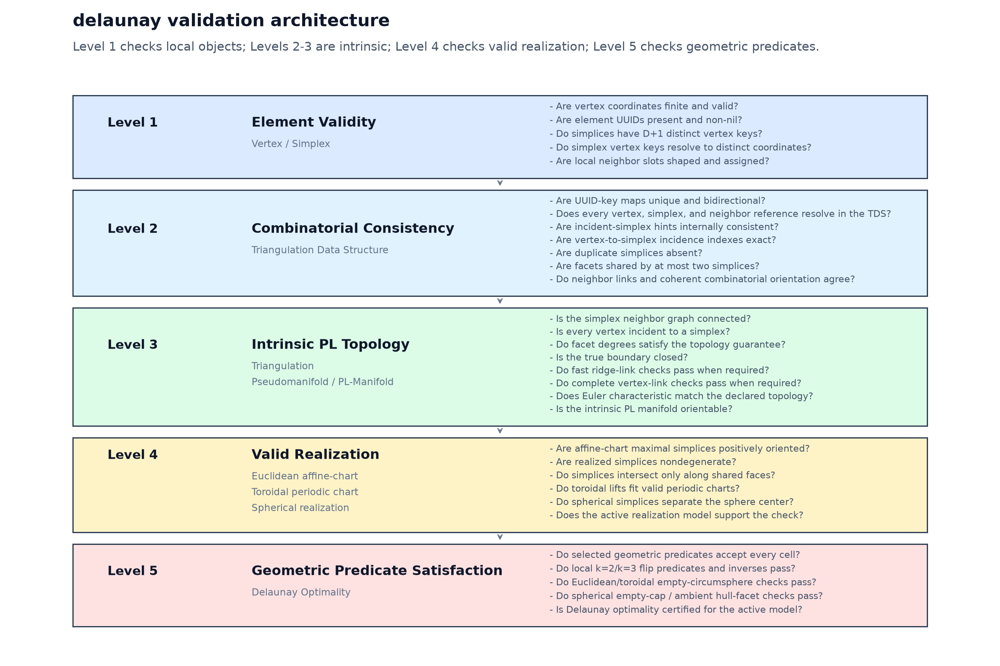
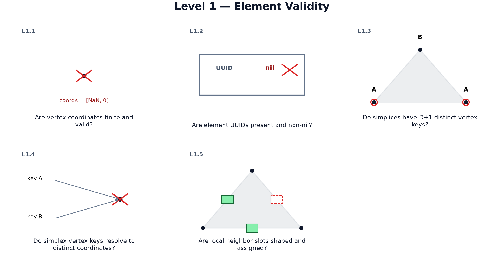
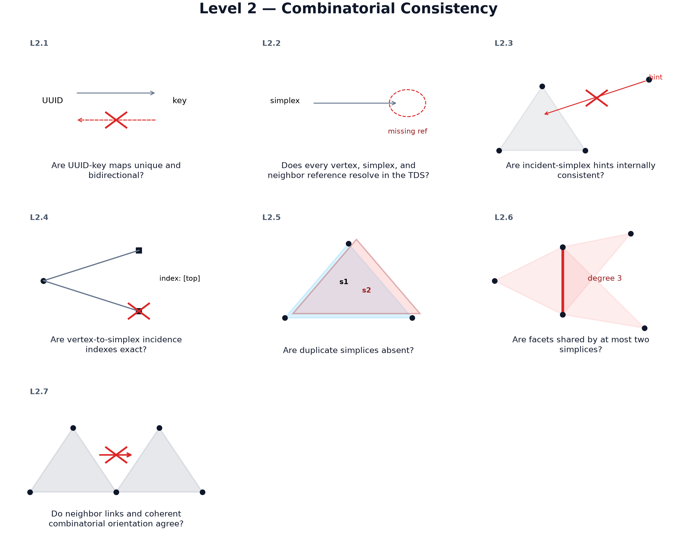
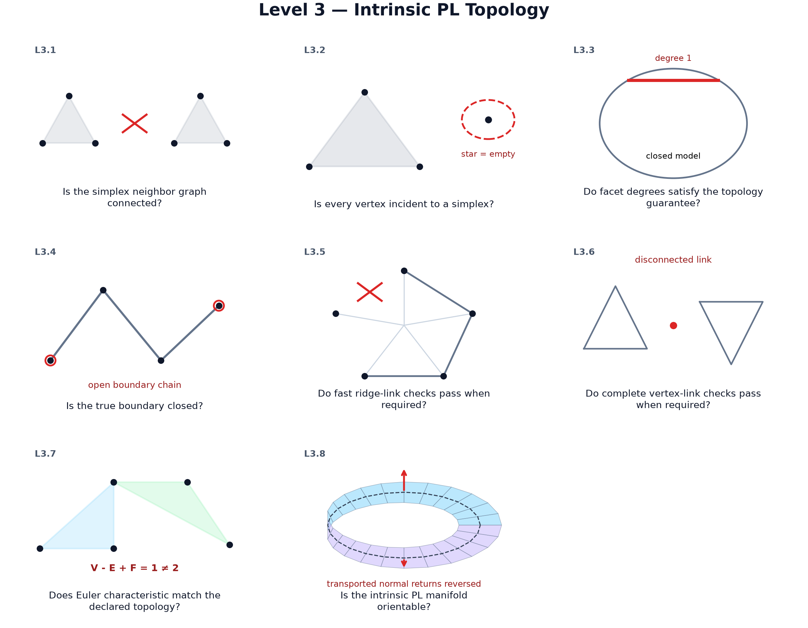
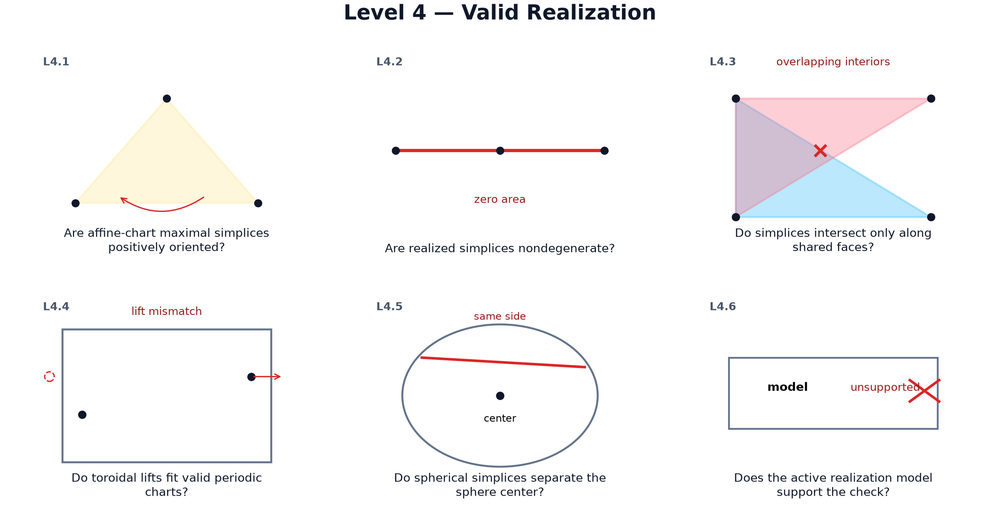
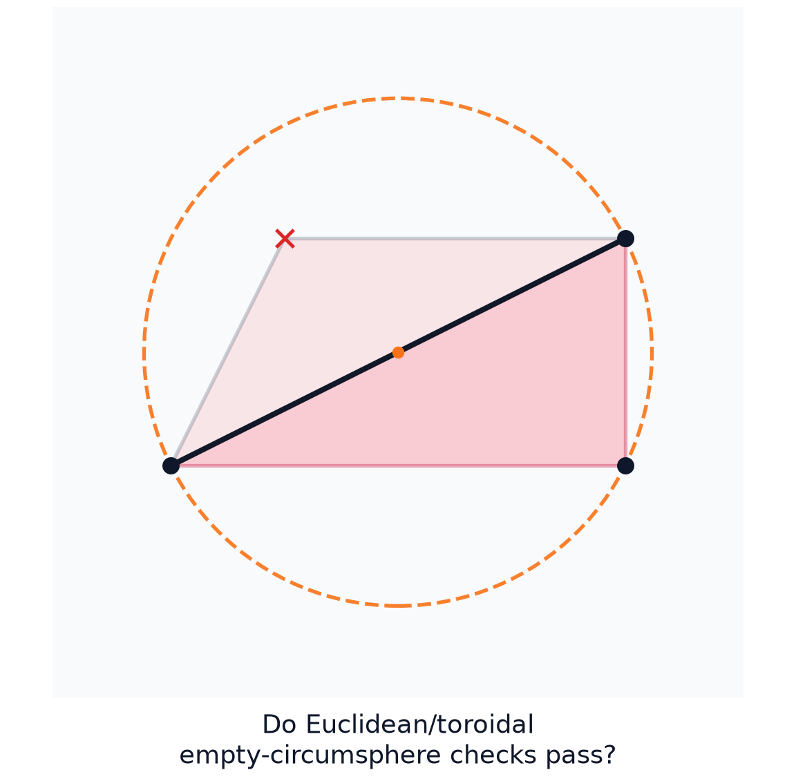

# Triangulation Validation Guide

<!-- markdownlint-configure-file { "MD033": { "allowed_elements": ["img"] } } -->

This document is the developer-facing validation contract for the `delaunay`
library. It explains the validation hierarchy and gives practical guidance on
when and how to use each validation level.

## Notebook-generated validation gallery

The deterministic [validation notebook](../notebooks/01_validation.ipynb)
renders the same five-layer hierarchy described below. Refresh the tracked
reviewer diagrams with `just validation-doc-figures`; routine notebook checks
write only under `target/`.
The [reviewer artifact guide](../papers/ARTIFACT.md) indexes this notebook
workflow and its paper-claim mapping.



The Level 3–5 panels make the critical separation explicit: intrinsic topology
can be valid while a realization overlaps, and a valid realization can
still violate the Delaunay empty-circumsphere predicate.

### Level 1 — Element Validity



### Level 2 — Combinatorial Consistency



### Level 3 — Intrinsic PL Topology



### Level 4 — Valid Realization



### Level 5 — Geometric Predicates



For the theoretical background, rationale, and implementation pointers behind the invariants, see
[`invariants.md`](invariants.md).

For publication-facing exposition, see
[`../papers/validation.tex`](../papers/validation.tex) and the compiled reviewer
copy at [`../papers/validation.pdf`](../papers/validation.pdf). For
reproducible figures used by the paper, see
[`../notebooks/01_validation.ipynb`](../notebooks/01_validation.ipynb).

Examples that derive `thiserror::Error` assume the example crate includes
`thiserror`; run `cargo add thiserror` alongside `delaunay` when copying those
snippets into an application.

## Overview

The library provides **five levels of validation**, each answering a different
correctness question while building on the previous level:

1. **Element Validity** - Are individual geometric and combinatorial objects internally valid?
2. **Combinatorial Consistency** - Does the TDS satisfy its incidence, adjacency, index, and stored-orientation invariants?
3. **Intrinsic PL Topology** - Does the abstract complex represent the intended PL topology, including orientability when required?
4. **Valid Realization** - Does the complex satisfy model-specific orientation and nondegeneracy constraints with only shared-face intersections?
5. **Geometric Predicates** - Does a valid realization satisfy the selected geometry-specific predicate family?

| Level | Concern | Depends on realization? |
|---|---|---|
| 1 | Local object correctness | No |
| 2 | Combinatorial structure | No |
| 3 | Intrinsic PL topology | No |
| 4 | Valid Realization | Yes |
| 5 | Geometric predicates | Yes |

This separation is why Level 3 does not change when spherical support is added:
PL-manifoldness is intrinsic, while spherical realization belongs in Level 4 and
spherical Delaunay belongs in Level 5.

## Validation Hierarchy

```text
Level 1: Element Validity
    ↓ (cumulative validation adds)
Level 2: Combinatorial Consistency
    ↓ (cumulative validation adds)
Level 3: Intrinsic PL Topology
    ↓ (cumulative validation adds)
Level 4: Valid Realization
    ↓ (cumulative validation adds)
Level 5: Geometric Predicates
```

Layer-local `is_valid_*` checks isolate one level; cumulative `validate()` and
`validation_report()` APIs add every lower layer owned by the receiver.

## Validation API Pattern

Each validation layer exposes the same public API shape when the layer can
support it without hiding useful failures:

- **Fast-fail check**: `is_valid()` is used when the owner already identifies
  the invariant scope (`Vertex`, `Simplex`, and `Tds`); `is_valid_*` is used
  for higher-level owners with multiple validation layers.
- **Repair/retry diagnostic**: `*_diagnostic` returns the first actionable
  layer-local diagnostic with keys, UUIDs, or other repair context where the
  layer can provide it.
- **Aggregate report**: `*_report` collects every checkable layer-local failure.
  If an early failure makes later checks meaningless, the report includes the
  blocking failure rather than guessing at downstream errors.
- **Cumulative validation**: `validate()` and `validation_report()` roll lower
  layers up through the owning abstraction.

Report names identify the layer being checked: `structure_report`,
`topology_report`, `realization_report`, and `delaunay_report`.

Higher-level reports roll up lower-level diagnostics as structured enum values,
not strings. This keeps `DelaunayTriangulation::validation_report()` useful both
as a full audit and as input to future repair workflows.

---

## Automatic validation during incremental insertion (`ValidationPolicy`)

The library always provides **explicit** validation APIs (Levels 1–5) that you can call when you need them.

Separately, incremental construction (`new()` / `insert*()`) can run an **automatic**
global Level 3 intrinsic-topology pass plus changed-scope Level 4 realization guards after an insertion attempt,
controlled by a `ValidationPolicy` on the triangulation.

This is a performance vs certainty knob: Level 3 (`Triangulation::is_valid_topology()`) and full
pairwise Level 4 (`Triangulation::is_valid_realization()`) are relatively expensive. The default depends
on the topology guarantee chosen for the incremental construction path:

- `TopologyGuarantee::PLManifold` starts with `ValidationPolicy::ExplicitOnly`, so normal insertions
  preserve local invariants and callers request global Level 3 / Level 4 checks explicitly.
- `TopologyGuarantee::Pseudomanifold` starts with `ValidationPolicy::OnSuspicion`, so automatic
  global topology and changed-scope realization checks run only when an insertion reports a suspicious
  local condition.

### What is validated automatically?

When the policy triggers automatic validation, it runs **Level 3**
(`Triangulation::is_valid_topology()`), using the triangulation’s current `TopologyGuarantee`
(default: `PLManifold`):

- Codimension-1 manifoldness (facet degree: 1 or 2 incident simplices per facet)
- Codimension-2 boundary manifoldness (the boundary is closed; "no boundary of boundary")
- Ridge-link validation (when `TopologyGuarantee::PLManifold` or `TopologyGuarantee::PLManifoldStrict`)
- Vertex-link validation during insertion (when `TopologyGuarantee::PLManifoldStrict`)
- Intrinsic orientability for 2D/3D PL-manifold guarantees, including ordinary
  and periodic quotient parity constraints
- Connectedness (single component)
- No isolated vertices
- Euler characteristic

Note: neighbor-pointer consistency is a **Level 2 Combinatorial Consistency** invariant checked by
`Tds::is_valid()` / `Tds::validate()`, and is intentionally not part of Level 3.

The same automatic validation pass then runs **Level 4 realization** guards for the changed simplex
scope. It always checks changed affine-chart simplices for positive orientation and degeneracy, then
checks changed-vs-current pairwise intersections. It does **not** rescan old-vs-old simplex pairs. It
also does **not** run Level 5
Delaunay empty-circumsphere validation. If you need complete Level 4 realization validation or a Level 5
geometric-predicate check, call `dt.as_triangulation().validate_realization()`, `dt.is_valid_delaunay()`,
`dt.delaunay_report()`, or `dt.validate()` explicitly.

### Default: derived from `TopologyGuarantee`

The initial policy is derived from the active `TopologyGuarantee`: `PLManifold`
uses `ValidationPolicy::ExplicitOnly`, `PLManifoldStrict` uses
`ValidationPolicy::Always`, and `Pseudomanifold` uses
`ValidationPolicy::OnSuspicion`.

With `ValidationPolicy::OnSuspicion`, global Level 3 plus changed-scope Level 4 guards run only when
insertion deviates from the happy-path and trips internal **suspicion flags**, e.g.:

- A perturbation retry was required (geometric degeneracy).
- The insertion fell back to a conservative “star-split” of the containing simplex.
- Non-manifold facet issues were detected and repaired (simplices removed).
- Neighbor pointers had to be repaired **and at least one pointer actually changed** (running the repair routine is not, by itself, considered suspicious).

### Available policies

- `ValidationPolicy::Never`: never run automatic global Level 3/changed-scope Level 4 checks; compatible only with
  `TopologyGuarantee::Pseudomanifold`.
- `ValidationPolicy::ExplicitOnly` *(default for `PLManifold`)*: do not run policy-triggered
  global Level 3/changed-scope Level 4 checks during insertion; caller-owned explicit validation
  APIs remain available, and insertion still keeps topology checks required by the active
  `TopologyGuarantee`.
- `ValidationPolicy::OnSuspicion` *(default for `Pseudomanifold`)*: run global Level 3/changed-scope Level 4 checks
  only when insertion is suspicious.
- `ValidationPolicy::Always`: run global Level 3/changed-scope Level 4 checks after every insertion attempt
  (slowest, best for tests).
- `ValidationPolicy::DebugOnly`: always run global Level 3/changed-scope Level 4 checks in debug builds; in release
  behaves like `OnSuspicion`.

### Example: configuring validation policy

```rust
use delaunay::prelude::construction::{
    DelaunayResult, DelaunayTriangulationBuilder, TopologyGuarantee, vertex,
};
use delaunay::prelude::validation::ValidationPolicy;

fn main() -> DelaunayResult<()> {
    let vertices = vec![
        vertex![0.0, 0.0, 0.0]?,
        vertex![1.0, 0.0, 0.0]?,
        vertex![0.0, 1.0, 0.0]?,
        vertex![0.0, 0.0, 1.0]?,
    ];

    let mut dt = DelaunayTriangulationBuilder::new(&vertices).build()?;

    // Default PL-manifold mode: caller-owned full validation checkpoints.
    assert_eq!(dt.validation_policy(), ValidationPolicy::ExplicitOnly);

    // For test/debug: validate topology after every insertion.
    dt.set_validation_policy(ValidationPolicy::Always);

    // For caller-owned full validation checkpoints with the default PL-manifold guarantee.
    dt.try_set_validation_policy(ValidationPolicy::ExplicitOnly)?;

    // `Never` is reserved for the relaxed pseudomanifold guarantee.
    dt.try_set_topology_guarantee(TopologyGuarantee::Pseudomanifold)?;
    dt.try_set_validation_policy(ValidationPolicy::Never)?;
    Ok(())
}
```

---

## Choosing Level 3 Intrinsic PL Topology guarantee (`TopologyGuarantee`)

Level 3 Intrinsic PL Topology validation can be configured to enforce either:

- **PL-manifold** invariants (default, uses ridge-link checks during insertion and
  requires completion-time vertex-link validation), or
- **Pseudomanifold / manifold-with-boundary** invariants (relaxed mode).

This is separate from [`ValidationPolicy`](#automatic-validation-during-incremental-insertion-validationpolicy),
which controls *when* Level 3 is run automatically during incremental insertion.
The builder keeps these axes coherent by deriving the initial validation policy
from `TopologyGuarantee`: `PLManifoldStrict` starts with `ValidationPolicy::Always`,
`PLManifold` starts with `ValidationPolicy::ExplicitOnly`, and
`Pseudomanifold` starts with `ValidationPolicy::OnSuspicion`.

### Default: `PLManifold`

`PLManifold` uses fast ridge-link validation during insertion and requires a
vertex-link validation pass at construction completion to certify full
PL-manifoldness. You can trigger that final certification via
`Triangulation::validate_at_completion()` (or `Triangulation::validate()`).

```rust
use delaunay::prelude::construction::{
    DelaunayResult, DelaunayTriangulationBuilder, TopologyGuarantee, vertex,
};
use delaunay::prelude::validation::ValidationPolicy;

fn main() -> DelaunayResult<()> {
    let vertices = vec![
        vertex![0.0, 0.0, 0.0]?,
        vertex![1.0, 0.0, 0.0]?,
        vertex![0.0, 1.0, 0.0]?,
        vertex![0.0, 0.0, 1.0]?,
    ];

    let mut dt = DelaunayTriangulationBuilder::new(&vertices).build()?;
    assert_eq!(dt.topology_guarantee(), TopologyGuarantee::PLManifold);

    // Optional: relax topology checks for speed (weaker guarantees).
    dt.set_topology_guarantee(TopologyGuarantee::Pseudomanifold);

    // Now Level 3 skips vertex-link validation entirely.
    assert!(dt.as_triangulation().is_valid_topology().is_ok());
    Ok(())
}
```

### Strict: `PLManifoldStrict`

`PLManifoldStrict` runs full vertex-link validation after every insertion. This
matches the legacy `PLManifold` behavior (slowest, maximum safety).

---

## Error Types by Layer

The library separates **construction-time** failures from **validation-time** invariant violations, and also separates errors by layer.

### Construction errors (building a triangulation)

- `TdsConstructionError` (Level 2 construction): internal TDS insertion/mapping failures
  (e.g. duplicate UUIDs).
- `TriangulationConstructionError` (Level 3 construction): wraps `TdsConstructionError` and adds
  triangulation-layer failures (e.g. `GeometricDegeneracy`, `DuplicateCoordinates`,
  `InsufficientVertices`).
- `DelaunayTriangulationConstructionError` (Level 5 construction): wraps
  `TriangulationConstructionError` and currently certifies the Delaunay predicate family.

### Validation errors (checking invariants)

- `TdsError` (Levels 1–2): element + structural invariants.
- `TriangulationValidationError` (Level 3 topology validation): reports
  codimension-1 manifoldness + codimension-2 boundary manifoldness (closed boundary) +
  (optional) link-based PL-manifold checks + 2D/3D intrinsic orientability +
  connectedness + isolated-vertex + Euler characteristic checks. The type also
  carries `OrientationPromotionNonConvergence` when a triangulation-layer repair
  cannot restore positive simplex orientation; that variant is a repair diagnostic,
  not an intrinsic-topology invariant.
- `InvariantError` (cumulative layer wrapper): preserves `TdsError`,
  `TriangulationValidationError`, `TriangulationRealizationValidationError`, or
  `DelaunayTriangulationValidationError` according to the failing level.
- `TriangulationRealizationValidationError` (Level 4): preserves lower-layer
  `TdsError` and `TriangulationValidationError` values and adds
  Euclidean/toroidal affine-chart orientation, nondegeneracy, and overlap checks.
- `SphericalDelaunayValidationError` (spherical prototype Levels 3-5): reports
  intrinsic PL-topology failures, spherical realization failures, and spherical
  Delaunay predicate failures for the bounded `S^2`/`S^3` backend.
- `DelaunayTriangulationValidationError` (Level 5): preserves lower-layer
  `TdsError`, `TriangulationValidationError`, and
  `TriangulationRealizationValidationError` values and adds the implemented
  geometric predicate checks, currently Delaunay.

### Reporting (full diagnostics)

`DelaunayTriangulation::validation_report()` returns `Result<(), TriangulationValidationReport>`.
On failure, the `Err(TriangulationValidationReport)` contains a `Vec<InvariantViolation>`; each
`InvariantViolation` stores an `InvariantKind` plus an `InvariantError` **enum** that wraps the
structured error from the failing layer (`TdsError`, `TriangulationValidationError`,
`TriangulationRealizationValidationError`, or `DelaunayTriangulationValidationError`).

---

## Level 1: Element Validity

### Purpose

Validates basic data integrity of individual vertices and simplices.

### Methods

- `Simplex::is_valid()` - Fast-fail simplex structure check
- `Simplex::simplex_diagnostic()` - First simplex repair/retry diagnostic
- `Simplex::simplex_report()` - Aggregate simplex validation report
- `Vertex::is_valid()` - Fast-fail vertex coordinate and UUID check
- `Vertex::vertex_diagnostic()` - First vertex repair/retry diagnostic
- `Vertex::vertex_report()` - Aggregate vertex validation report
- `Tds::validate()` / `Tds::validation_report()` - Cumulative Levels 1–2 APIs that can resolve
  simplex vertex keys for local coordinate-uniqueness checks

### What It Checks

- **Vertices**: Coordinate validity, UUID presence, dimension consistency
- **Simplices**: Correct number of vertices (D+1), no duplicate vertices, valid UUID
- **Resolved simplex coordinates**: Distinct vertex keys in one simplex resolve to distinct points

### Complexity

- **Time**: O(1) per standalone element; O(N×D²) for the cumulative TDS coordinate roll-up
- **Space**: O(1)

### When to Use

- Building blocks for higher-level validation
- Rarely called directly by users
- Automatically included by cumulative Levels 1–2 validation

### Example

```rust
use delaunay::prelude::construction::{
    DelaunayTriangulation, TopologyGuarantee, vertex,
};
use delaunay::prelude::validation::ValidationPolicy;

let v = vertex![0.0, 0.0, 0.0]?;
assert!(v.is_valid().is_ok());
```

---

## Level 2: Combinatorial Consistency

### Purpose

Validates the combinatorial structure of the simplicial complex as represented
by the Triangulation Data Structure.

### Methods

- `Tds::is_valid()` - Level 2 Combinatorial Consistency checks only (fast-fail).
- `Tds::structure_diagnostic()` - First actionable Level 2 diagnostic.
- `Tds::structure_report()` - All checkable Level 2 combinatorial failures.
- `Tds::validate()` - Levels 1–2 (Element Validity + Combinatorial Consistency).
- `Triangulation::is_valid_structure()` /
  `DelaunayTriangulation::is_valid_structure()` - Owner-level Level 2
  fast-fail validation without exposing storage.
- `Triangulation::validate_structure()` /
  `DelaunayTriangulation::validate_structure()` - Owner-level Levels 1–2
  validation.
- `Triangulation::structure_diagnostic()` /
  `DelaunayTriangulation::structure_diagnostic()` - Owner-level first
  actionable Level 2 diagnostic.
- `Triangulation::structure_report()` /
  `DelaunayTriangulation::structure_report()` - Owner-level aggregate Level 2
  diagnostics.
- `DelaunayTriangulation::validation_report()` - Cumulative diagnostic report across Levels 1–5.

### What It Checks

`Tds::is_valid()` (Level 2) checks:

1. **UUID ↔ Key Mappings**: Bidirectional consistency for vertices and simplices
2. **Resolved References**: Every simplex vertex, simplex neighbor, and optional
   vertex incident-simplex hint resolves to a compatible stored object
3. **Vertex-to-Simplices Index**: The derived incidence index exactly matches
   simplex membership
4. **No Duplicate Simplices**: No simplices with identical vertex sets
5. **Facet Sharing Invariant**: Each facet shared by at most 2 simplices
6. **Neighbor Consistency**: Mutual neighbor relationships are correct:
   manifold boundary facets are open, interior facets have reciprocal
   neighbors, and admissible periodic self-neighbors are closed topology.
7. **Stored Coherent Orientation**: Adjacent simplex orderings induce compatible
   opposite facet orientations. Periodic facets compare translation-normalized
   lifted `(vertex, offset)` identities, including quotient self-identifications.

`Tds::validate()` (Levels 1–2) additionally rolls up these Level 1 checks:

- **Vertex Validity**: All vertices pass `Vertex::is_valid()`
- **Simplex Validity**: All simplices pass `Simplex::is_valid()`
- **Simplex Coordinate Uniqueness**: No simplex contains two vertices with identical coordinates
  (exact `OrderedFloat` comparison). Duplicate-coordinate vertices produce zero-volume
  simplices that break SoS and Pachner moves.
  **Note**: Level 2 `is_valid()` and `structure_report()` do **not** check coordinate uniqueness.
  Use cumulative `validate()` or `validation_report()` for the stronger Level 1 guarantee.

### Complexity

- **Time**: O(N×D²) where N = number of simplices, D = dimension
- **Space**: O(N×D) for facet-to-simplices map

### When to Use

- **Production**: After construction or major modifications
- **Tests**: In test suites to catch structural bugs
- **Development builds**: Run explicit validation and propagate the typed error

### Example

```rust
use delaunay::prelude::construction::{
    DelaunayResult, DelaunayTriangulationBuilder, TopologyGuarantee, vertex,
};
use delaunay::prelude::validation::ValidationPolicy;

fn main() -> DelaunayResult<()> {
    let vertices = vec![
        vertex![0.0, 0.0, 0.0]?,
        vertex![1.0, 0.0, 0.0]?,
        vertex![0.0, 1.0, 0.0]?,
        vertex![0.0, 0.0, 1.0]?,
    ];
    let dt = DelaunayTriangulationBuilder::new(&vertices).build()?;

    // Quick Combinatorial Consistency check (Level 2)
    assert!(dt.is_valid_structure().is_ok());

    // Detailed report showing all violations across Levels 1–5 (on failure)
    match dt.validation_report() {
        Ok(()) => println!("✓ All invariants satisfied"),
        Err(report) => {
            for violation in report.violations {
                eprintln!("Invariant violation: {:?}", violation);
            }
        }
    }
    Ok(())
}
```

### Diagnostics

For most users, start with `dt.is_valid_structure()` (fast-fail) or `dt.validation_report()` (full diagnostics across Levels 1–5).

---

## Level 3: Intrinsic PL Topology

### Purpose

Validates that the triangulation satisfies the requested intrinsic PL-topology
contract, ranging from relaxed pseudomanifold checks to strict PL-manifold
certification.

### Methods

- `Triangulation::is_valid_topology()` - Level 3 Intrinsic PL Topology fast-fail validation only.
- `Triangulation::topology_diagnostic()` - First actionable Level 3 diagnostic.
- `Triangulation::topology_report()` - All checkable Level 3 Intrinsic PL Topology failures.
- `Triangulation::validate_ridge_links()` - Explicit global ridge-link
  PL-manifold diagnostic.
- `Triangulation::validate_ridge_links_for_simplices()` - Explicit localized
  ridge-link diagnostic for a touched simplex frontier.
- `Triangulation::validate_vertex_links()` - Explicit vertex-link
  PL-manifold certification.
- `Triangulation::validate()` - Levels 1–3 (Element Validity + Combinatorial Consistency +
  Intrinsic PL Topology).

### What It Checks

`Triangulation::is_valid_topology()` (Level 3 Intrinsic PL Topology) checks:

1. **Codimension-1 manifoldness (facet degree)**: Each facet belongs to exactly 1 simplex (boundary) or exactly 2 simplices (interior)
   - Stronger than Level 2's "≤2 simplices per facet"
2. **Codimension-2 boundary manifoldness (closed boundary)**: Each (d−2)-ridge on the boundary must be incident to exactly 2 boundary facets
   - This is the "no boundary of boundary" condition
   - Interior ridges can have higher degree; only boundary ridges are constrained
3. **PL-manifold ridge-link condition** (when `TopologyGuarantee::PLManifold` or
   `TopologyGuarantee::PLManifoldStrict`):
   The link of every checked ridge is a connected path or cycle. Use
   `dt.validate_ridge_links()` for a global explicit check, or
   `dt.validate_ridge_links_for_simplices(touched)` after a local edit.
4. **PL-manifold vertex-link condition** (when `TopologyGuarantee::PLManifold` certifies
   construction completion, or when `TopologyGuarantee::PLManifoldStrict` checks every insertion):
   For every vertex `v`, the link `Lk(v)` must be a (D−1)-sphere (interior vertex) or (D−1)-ball (boundary vertex).
   Use `dt.validate_vertex_links()` for an explicit owner-level check.
5. **Intrinsic orientability** (for the 2D/3D PL-manifold guarantees):
   Ordinary and periodic shared-facet parity constraints must admit a coherent assignment.
   Use `Triangulation::orientation_witness()` to obtain the opaque
   simplex-reversal certificate directly. A parity obstruction is reported as
   the typed Level 3 `TriangulationValidationError::NonOrientable` diagnostic.
6. **Connectedness**: All simplices form a single connected component in the simplex neighbor graph
   - Detected via a graph traversal over neighbor pointers (O(N·D))
7. **No isolated vertices**: Every vertex must be incident to at least one simplex
8. **Euler Characteristic**: χ matches expected topology (when an expectation is defined)
   - Empty: χ = 0
   - Single simplex / Ball(D): χ = 1
   - Closed sphere S^D: χ = 1 + (-1)^D
   - Unknown: χ is computed but not enforced

Intrinsic orientability is distinct from Level 2 stored-ordering coherence:
reversing one stored simplex can violate `Tds::is_valid()` without changing
whether the underlying complex is orientable, while reversing every simplex
preserves coherence. Euler characteristic and manifold-link checks do not imply
orientability. Positive geometric orientation belongs to Level 4 and is not a
substitute for the intrinsic Level 3 certificate. Periodic quotient facets use
translation-normalized lifted vertex identities, and self-identifications
contribute explicit quotient parity constraints.

`Triangulation::validate()` (Levels 1–3) additionally runs `Tds::validate()` first.
The `DelaunayTriangulation` wrapper forwards the explicit ridge-link and
vertex-link validators to its owned `Triangulation`, so Delaunay workflows can
call `dt.validate_ridge_links()`, `dt.validate_ridge_links_for_simplices(...)`,
and `dt.validate_vertex_links()` directly.

### Complexity

- **Time**: O(N×D²) dominated by simplex counting (connectedness adds O(N·D))
- **Space**: O(N×D) for edge/facet sets

### When to Use

- **Tests**: Verify topological correctness in test suites
- **Debug builds**: After complex operations that might break manifold structure
- **Production**: Only when topological guarantees are critical
- **Not recommended**: Hot paths or large triangulations (expensive)

### Example

```rust
use delaunay::prelude::construction::{
    DelaunayResult, DelaunayTriangulationBuilder, TopologyGuarantee, vertex,
};
use delaunay::prelude::validation::ValidationPolicy;

fn main() -> DelaunayResult<()> {
    let vertices = vec![
        vertex![0.0, 0.0, 0.0]?,
        vertex![1.0, 0.0, 0.0]?,
        vertex![0.0, 1.0, 0.0]?,
        vertex![0.0, 0.0, 1.0]?,
        vertex![0.25, 0.25, 0.25]?, // Interior point
    ];
    let dt = DelaunayTriangulationBuilder::new(&vertices).build()?;

    // Thorough topology validation (includes Levels 1–2 TDS checks)
    match dt.as_triangulation().validate() {
        Ok(()) => println!("✓ Valid manifold with correct Euler characteristic"),
        Err(e) => eprintln!("✗ Topology validation failed: {}", e),
    }
    Ok(())
}
```

---

## Level 4: Valid Realization

### Purpose

Validates that the coordinate realization of the abstract triangulation is geometrically valid in
the active model.

The terminology separates the generic Level 4 contract from its model-specific implementations:

```text
Level 4: Valid Realization
  Euclidean/toroidal: valid affine-chart realization
  Spherical: valid spherical realization
Level 5: Geometric Predicate Satisfaction / Delaunay Optimality
```

For Euclidean and toroidal affine-chart models, the Level 4 contract is: the vertex map is
injective, every abstract simplex is realized with positive orientation and nonzero volume in the
active chart, and any two realized simplices intersect exactly in the realization of their shared
abstract face:

```text
|sigma| ∩ |tau| = |sigma ∩ tau|
```

This is a validation contract over the finite coordinate realization the crate constructs or accepts.
It is not a general realization algorithm for an arbitrary abstract PL-manifold into
coordinates.

### Methods

- `Triangulation::is_valid_realization()` - Level 4 realization fast-fail validation only.
- `Triangulation::realization_diagnostic()` - First actionable Level 4 diagnostic.
- `Triangulation::realization_report()` - Level 4 diagnostic report with offending
  simplex and vertex keys/UUIDs.
- `Triangulation::validate_realization()` - Levels 1–4 (elements + combinatorics + intrinsic topology + realization).

### What It Checks

- **Positive affine-chart orientation**: every Euclidean/toroidal maximal simplex has the canonical
  positive geometric sign in its active chart.
- **Nondegenerate affine-chart simplices**: every Euclidean/toroidal maximal simplex has nonzero
  `D`-volume by the robust orientation predicate.
- **No affine-chart overlap outside shared faces**: any two Euclidean/toroidal maximal simplices may
  intersect only in the realization of the face spanned by their shared vertices.
- **Toroidal periodic images**: toroidal topology is checked in covering-space charts, including
  periodic translates that can overlap across the fundamental-domain boundary.
- **Spherical prototype simplices**: `SphericalDelaunayTriangulation` validates `S^2`/`S^3`
  maximal simplices as nondegenerate spherical simplices realized in `S^D \subset R^(D+1)`.
- **Geometric validity, not optimality**: Level 4 does not evaluate empty-circumsphere,
  empty-cap, regular, weighted, or constrained predicates. It catches invalid realizations before
  Level 5 asks whether the realized triangulation satisfies the selected predicate family.

General spherical integration with the ordinary mutable triangulation surface, dimensions beyond
the bounded `S^2`/`S^3` prototype, and hyperbolic topology still return unsupported-topology errors
until model-specific chart validators are implemented.

### Complexity

The following bounds describe the ordinary Euclidean/toroidal affine-chart validator; the bounded
spherical prototype uses its separate model-specific realization checks.

- **Time**: O(simplices² × f(D)) for pairwise simplex-intersection checks in fixed dimension, with
  bounding-box pruning before exact rational barycentric witness construction.
- **Space**: O(D²) to O(simplices) temporary space depending on the number of candidate overlaps.

For the broad-phase overlap-detection references, see the
[Realized-Simplex Overlap Detection](../REFERENCES.md#realized-simplex-overlap-detection-level-4-validation)
section of `REFERENCES.md`.

### When to Use

- **Tests**: After construction or manual edits when realized correctness matters.
- **Debug**: Investigating folded, self-overlapping, or zero-volume triangulations.
- **Before geometric-predicate certification**: Level 5 validation runs Level 4 first so Delaunay
  or future predicates are evaluated only on a valid realization.
- **Repair planning**: `Triangulation::realization_report()` reports simplex keys, UUIDs, shared
  vertices, and witness vertices that can guide explicit rollback or deletion-based repair. The
  validator itself is pure and does not delete vertices.

### Pachner and Orientation Failure Modes

Pachner and raw bistellar transactions keep orientation and realization contracts distinct. Level 2
coherent orientation is combinatorial: adjacent simplices must induce opposite orientations on their
shared facets. The triangulation storage contract also promotes affected maximal simplices to
positive geometric orientation before the edited state is accepted. Level 4 realization validation
then certifies that affine-chart maximal simplices have positive sign and nonzero volume, and that
realized simplices do not fold or overlap outside shared faces.

A local move can satisfy one contract while violating the other. The ordinary `PachnerProposal::attempt_on`
path canonicalizes replacement simplex orientation, preserves realized-geometry validity, and rolls
back with typed `FlipError` or validation errors if the repaired state still violates the contract.
The hidden `attempt_topology_on` path is narrower: it is reserved for diagnostics and benchmarks that
intentionally validate topology-scope invariants without paying the Level 4 overlap scan after every
move.

### Example

```rust
use delaunay::prelude::construction::{
    DelaunayResult, DelaunayTriangulationBuilder, vertex,
};

fn main() -> DelaunayResult<()> {
    let vertices = vec![
        vertex![0.0, 0.0, 0.0]?,
        vertex![1.0, 0.0, 0.0]?,
        vertex![0.0, 1.0, 0.0]?,
        vertex![0.0, 0.0, 1.0]?,
    ];
    let dt = DelaunayTriangulationBuilder::new(&vertices).build()?;

    // Realization validation (Levels 1-4)
    match dt.as_triangulation().validate_realization() {
        Ok(()) => println!("valid realized triangulation"),
        Err(e) => eprintln!("realization violation: {}", e),
    }
    Ok(())
}
```

---

## Level 5: Geometric Predicates

### Purpose

Validates geometry-specific predicates on a valid realization. This is the geometric optimality
layer: the implemented predicate family today is Delaunay, and the layer is intentionally broad
enough for future regular, weighted, Gabriel, alpha, constrained, or related predicates.

### Methods

- `DelaunayTriangulation::is_valid_delaunay()` - Level 5 Delaunay predicate only; cumulative
  `validate()` runs Level 4 realization validation first.
- `DelaunayTriangulation::delaunay_diagnostic()` - First actionable Level 5 diagnostic, including the
  violating simplex, its vertices, neighbor slots, and an offending vertex when available.
- `DelaunayTriangulation::delaunay_report()` - All checkable Level 5 Delaunay failures with the same
  repair-oriented detail where it can be reconstructed.
- `DelaunayTriangulation::validate()` - Levels 1–5 (elements + combinatorics + intrinsic topology +
  realization + geometric predicates).

### What It Checks

- **Delaunay property**: verified via local flip predicates (k=2/k=3 and
  inverses), equivalent to the empty-circumsphere condition for properly
  constructed triangulations
- Uses geometric predicates from the kernel (`insphere` test)
- **Spherical prototype**: `SphericalDelaunayTriangulation` keeps Level 5 Geometric Predicates
  backend-specific. Its `S^2`/`S^3` path checks the spherical empty-cap
  condition by requiring each simplex to be an ambient supporting hull facet in
  `R^(D+1)`, with all non-simplex vertices on the same side as the sphere center
  or on the facet hyperplane. Euclidean and toroidal triangulations keep using
  their existing empty-circumsphere validators.
- **Layered after Levels 1-4**: `validate()` checks elements, combinatorics, intrinsic topology,
  and realization before the geometric-predicate layer.
- **Flip-based repair**: Insertions run k=2/k=3 flip repairs with inverse edge/triangle queues in
  higher dimensions by default. Delaunay validation can still fail if repair is disabled, if repair
  fails to converge, or if inputs are highly degenerate/duplicate-heavy. See
  [Issue #120 Investigation](archive/issue_120_investigation.md).
- **Heuristic fallback**: If flip-based repair does not converge, you can opt into a heuristic
  rebuild fallback via `DelaunayTriangulation::repair_delaunay_with_flips_advanced`.
  This requires `TopologyGuarantee::PLManifold` and `K: ExactPredicates`, and records the
  shuffle/perturbation seeds used. See [Numerical Robustness Guide](numerical_robustness_guide.md).

### Complexity

- **Time**:
  - `DelaunayTriangulation::is_valid_delaunay()` (Level 5 only): O(simplices) local flip-predicate verification.
  - `DelaunayTriangulation::validate()` (Levels 1–5): Levels 1-4 plus O(simplices) local flip-predicate verification.
  - `DelaunayTriangulation::validation_report()` (Levels 1–5): Levels 1-4 plus O(simplices) local flip-predicate verification.
- **Space**: O(1) additional space (aside from temporary working sets)

### When to Use

- **Critical Applications**: When Delaunay guarantees are essential (interpolation, mesh quality)
- **Tests**: After construction to verify correctness
- **Debug**: Investigating geometric issues or suspected violations
- **Avoid**: Hot loops (still O(simplices); use for spot checks / tests)

### Example

```rust
use delaunay::prelude::construction::{
    DelaunayResult, DelaunayTriangulationBuilder, TopologyGuarantee, vertex,
};
use delaunay::prelude::validation::ValidationPolicy;

fn main() -> DelaunayResult<()> {
    let vertices = vec![
        vertex![0.0, 0.0, 0.0]?,
        vertex![1.0, 0.0, 0.0]?,
        vertex![0.0, 1.0, 0.0]?,
        vertex![0.0, 0.0, 1.0]?,
    ];
    let dt = DelaunayTriangulationBuilder::new(&vertices).build()?;

    // Delaunay geometric-predicate validation (Level 5)
    match dt.is_valid_delaunay() {
        Ok(()) => println!("✓ All simplices satisfy empty circumsphere property"),
        Err(e) => eprintln!("✗ Delaunay violation: {}", e),
    }
    Ok(())
}
```

---

## Decision Tree: Which Validation Level to Use?

```text
Start: Do you need to validate?
    │
    ├─ Writing tests / CI? → Always validate (start with Level 2; add Levels 3/4/5 as needed)
    │
    ├─ Just built triangulation?
    │   ├─ Production hot path? → Usually skip (but validate during integration testing / when debugging)
    │   └─ Need certainty? → Validate (Level 2 or 3; add Level 4 if realization matters, Level 5 if predicates matter)
    │
    ├─ After manual topology mutation? → Level 2 (`dt.is_valid_structure()`)
    │
    ├─ Debugging realized-geometry issues? → Level 4 (`dt.as_triangulation().validate_realization()`)
    │
    ├─ Debugging Delaunay or other geometric-predicate issues? → Level 5 (`dt.is_valid_delaunay()`)
    │
    ├─ Production validation?
    │   ├─ Performance critical? → Level 2 (`dt.is_valid_structure()`)
    │   ├─ Topological correctness critical? → Level 3 (`dt.as_triangulation().is_valid_topology()`)
    │   ├─ Realization correctness critical? → Level 4 (`dt.as_triangulation().validate_realization()`)
    │   └─ Delaunay or geometric-predicate correctness critical? → Level 5 (`dt.is_valid_delaunay()`)
    │
    └─ Paranoid mode? → All levels (`dt.validate()`)
```

---

## Performance notes

- Level 2 Combinatorial Consistency and Level 3 Intrinsic PL Topology validation are dominated by
  combinatorial bookkeeping (roughly O(simplices × D²)).
- Level 4 Valid Realization checks simplex degeneracy and pairwise realized-simplex
  intersections, using bounding boxes before exact rational witness construction.
- Level 5 `DelaunayTriangulation::is_valid_delaunay()` verifies the implemented Delaunay predicate
  family via local flip predicates after Level 4 realization validation.
- A brute-force empty-circumsphere check would be O(simplices × vertices) and is not used by `is_valid_delaunay()`.

In practice, `DelaunayTriangulation::validate()` is usually dominated by Level 3 Intrinsic PL Topology work or
Level 4 pairwise realization checks, depending on mesh size and overlap candidates.
As a post-construction acceptance check, the current 7,500-vertex 3D large-scale
debug harness is the default near-one-minute `validation_report` run for Levels
1–5; on maintainer Apple M4 Max hardware the final report itself is a
low-single-digit-second step.
The explicit 10,000-vertex 3D run is a heavier characterization probe that has
also passed Levels 1–5 validation, but it is not the default local acceptance
helper.

---

## Common Patterns

`Triangulation::is_valid_topology()` returns `InvariantError`, the public wrapper enum
used for validation failures across Levels 1–4. Its variants preserve the
failing layer's typed error: `TdsError` for Levels 1–2,
`TriangulationValidationError` for Level 3 Intrinsic PL Topology failures, and
`TriangulationRealizationValidationError` for Level 4 realization failures. In normal
Level 3 code, handle the wrapper as shown in Patterns 2 and 3 rather than
expecting `TriangulationValidationError` directly.

### Pattern 1: Test Suite Validation

```rust
#[test]
fn test_my_triangulation_operation() {
    let mut dt = create_test_triangulation();

    // Perform operation
    my_operation(&mut dt);

    // Validate at appropriate level
    assert!(dt.is_valid_structure().is_ok()); // Level 2: Combinatorial Consistency
    assert!(dt.as_triangulation().is_valid_topology().is_ok()); // Level 3: Intrinsic PL Topology
    assert!(dt.as_triangulation().validate_realization().is_ok()); // Level 4: Valid Realization
    assert!(dt.is_valid_delaunay().is_ok());        // Level 5: Geometric Predicates (Delaunay)
    assert!(dt.validate().is_ok());                 // Levels 1–5: Full validation
}
```

### Pattern 2: Development Validation

```rust
use delaunay::prelude::query::*;
use delaunay::prelude::tds::{InvariantError, TdsError};

#[derive(Debug, thiserror::Error)]
pub enum DevelopmentValidationError {
    #[error(transparent)]
    Tds(#[from] TdsError),
    #[error(transparent)]
    Topology(#[from] InvariantError),
}

pub fn my_algorithm(
    dt: &mut DelaunayTriangulation<FastKernel<f64>, (), (), 3>,
) -> Result<(), DevelopmentValidationError> {
    // Do work...

    #[cfg(debug_assertions)]
    {
        dt.validate_structure()?;
        dt.as_triangulation().is_valid_topology()?;
    }

    Ok(())
}
```

### Pattern 3: Conditional Deep Validation

```rust
use delaunay::prelude::query::*;
use delaunay::prelude::tds::{InvariantError, TdsError};
use delaunay::prelude::validation::{
    DelaunayTriangulationValidationError, TriangulationRealizationValidationError,
};

#[derive(Debug, thiserror::Error)]
pub enum ValidationLevelError {
    #[error(transparent)]
    Tds(#[from] TdsError),
    #[error(transparent)]
    Topology(#[from] InvariantError),
    #[error(transparent)]
    Realization(#[from] TriangulationRealizationValidationError),
    #[error(transparent)]
    Delaunay(#[from] DelaunayTriangulationValidationError),
    #[error("unsupported validation level {level}; expected 2, 3, 4, or 5")]
    UnsupportedLevel { level: u8 },
}

pub fn validate_with_level(
    dt: &DelaunayTriangulation<FastKernel<f64>, (), (), 3>,
    level: u8,
) -> Result<(), ValidationLevelError> {
    match level {
        2 => dt.validate_structure().map_err(ValidationLevelError::from),
        3 => dt
            .as_triangulation()
            .is_valid_topology()
            .map_err(ValidationLevelError::from),
        4 => dt
            .as_triangulation()
            .validate_realization()
            .map_err(ValidationLevelError::from),
        5 => dt.is_valid_delaunay().map_err(ValidationLevelError::from),
        _ => Err(ValidationLevelError::UnsupportedLevel { level }),
    }
}
```

---

## Troubleshooting

### Validation Fails at Level 2

**Problem**: Structural invariants violated
**Likely Cause**: Bug in construction or mutation code
**Fix**: Check for duplicate simplices, incorrect neighbor assignments, mapping/index inconsistencies,
or incompatible stored simplex orderings across ordinary or periodic facets

### Validation Passes Level 2, Fails at Level 3

**Problem**: Codimension-1 manifoldness violated (facet has 0 or >2 simplices), boundary is not closed ("boundary of boundary"),
triangulation disconnected, isolated vertex present, intrinsic orientation constraints are contradictory,
or Euler characteristic is wrong
**Likely Cause**: Non-manifold topology, missing/broken neighbor wiring, boundary topology corruption,
non-orientable 2D/3D PL topology, contradictory periodic quotient parity, or disconnected components
**Fix**: Check facet-to-simplices mapping, ensure boundary ridges have degree 2 within boundary facets,
ensure no isolated vertices, verify the simplex neighbor graph is connected, and inspect
`orientation_witness()` / `TriangulationValidationError::NonOrientable`

### Validation Passes Level 3, Fails at Level 4

**Problem**: Invalid realized-simplex orientation, degeneracy, or overlap outside shared faces
**Likely Cause**: Negative affine-chart orientation, folded realization, duplicate/collinear/coplanar coordinates,
or a toroidal periodic image that overlaps across the fundamental-domain boundary
**Fix**: Inspect the realization error's simplex keys, UUIDs, shared vertices, and witness vertices.
If this happened during insertion, rollback or explicit deletion-based repair can use those witnesses,
but the validator itself does not mutate the triangulation.

### Validation Passes Level 4, Fails at Level 5

**Problem**: Delaunay property violated (vertex inside circumsphere)
**Likely Cause**: Repair disabled or non-convergent, geometric degeneracy, numerical precision,
or missing higher-dimensional flip coverage
**Fix**: Keep flip repair enabled, handle insertion errors, check for near-coplanar/collinear points,
and consider using `RobustKernel` or `AdaptiveKernel` instead of `FastKernel` (explicit repair
methods require `K: ExactPredicates`, which `FastKernel` does not implement). If repair fails to
converge, consider the opt-in heuristic rebuild fallback via
`dt.repair_delaunay_with_flips_advanced(...)` (requires PL-manifold + `ExactPredicates`).

---

## API Reference Summary

| Level | Method | Module | Complexity |
|-------|--------|--------|------------|
| 1 | `Simplex::is_valid()` / `simplex_report()` | `tds` | O(1) |
| 1 | `Vertex::is_valid()` / `vertex_report()` | `tds` | O(1) |
| 2 | `Tds::is_valid()` | `tds` | O(N×D²) |
| 2 | `Tds::validate()` | `tds` | O(N×D²) |
| 3 | `Triangulation::is_valid_topology()` | `triangulation` | O(N×D²) |
| 3 | `Triangulation::validate()` | `triangulation` | O(N×D²) |
| 4 | `Triangulation::is_valid_realization()` | `triangulation` | O(simplices² × f(D)) |
| 4 | `Triangulation::validate_realization()` | `triangulation` | O(simplices × D²) + O(simplices² × f(D)) |
| 5 | `DelaunayTriangulation::is_valid_delaunay()` | `delaunay` | O(simplices) |
| 5 | `DelaunayTriangulation::validate()` | `delaunay` | Levels 1-4 + O(simplices) |
| — | `DelaunayTriangulation::validation_report()` | `delaunay` | Levels 1-4 + O(simplices) |

---

## See Also

- [Invariants](invariants.md) - Theoretical background and rationale for the invariants
- [Topology](topology.md) - Level 3 Intrinsic PL Topology invariants and combinatorial checks
- [Code Organization](code_organization.md) - Where to find validation code
- [CGAL Triangulation](https://doc.cgal.org/latest/Triangulation/index.html) - Inspiration for validation design
